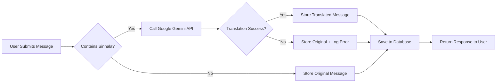

<div align="center">

# 🎓 Quality Education Backend

### A Web-Based Peer Learning and Tutoring Platform for School Students


</div>

---

## 📌 Overview

**Quality Education** is a web-based peer-learning and tutoring platform designed to connect school students with qualified tutors in an efficient and scalable manner.

The platform enables students to request academic help, **automatically translates Sinhala messages into English** using the **Google Gemini API**, and allows tutors to respond effectively.

This system promotes **accessible, structured, and collaborative digital education**.

---

## 🚀 Key Features

### 🔐 Authentication & Authorization
👨‍💻 Developed by **H A S Maduwantha** — Student ID: `IT23472020`
- ✅ **Role-based access control (RBAC)**
- ✅ Secure login & registration
- ✅ JWT-based authentication
- ✅ Three user roles:
  - 👨‍🎓 **Student (User)**
  - 👨‍🏫 **Tutor**
  - 🛡️ **Admin**

### 💬 Help Request Management (Full CRUD)
👨‍💻 Developed by **H A S Maduwantha** — Student ID: `IT23472020`
#### Students can:
- ✍️ Create help requests
- 👀 View submitted requests
- ✏️ Update messages (with translation support)
- 🗑️ Delete requests

#### Tutors & Admin can:
- 📋 View all help requests
- 💡 Respond to student queries

### 🌍 Sinhala to English Translation

- 🔍 **Detects Sinhala Unicode range** (0D80–0DFF)
- 🤖 **Automatically translates** to English using Google Gemini API
- 💾 Stores translated message in database
- ⚡ Avoids API call if message is already English (optimization)
- 🔄 **Translation on both create and update** operations

### 📚 Study Materials & Resources
👨‍💻 Developed by **ALAHAKOON PB** — Student ID: `IT23405240`

- 📤 **Upload study materials** — PDF, DOC, DOCX, PPT, PPTX, TXT, images (max 5 MB) via Cloudinary
- 📋 **View & search** — full-text keyword search across title, description, and tags
- 🔍 **Filter** by subject, grade, and status (active / archived / pending)
- 📄 **Pagination & sorting** — latest, oldest, by subject or title
- ✏️ **Update** — edit metadata or replace file (old Cloudinary file auto-deleted)
- 🗑️ **Delete** — removes from DB and Cloudinary storage atomically
- 👤 **My Uploads** — tutors can view only their own materials
- 📊 **Engagement metrics** — view count (auto), download counter, like/unlike toggle
- 🔒 **Role-based access** — only tutors/admins can upload, update, or delete
- 🛡️ **Security** — NoSQL injection protection, likedBy array hidden, Cloudinary rollback on failure

### 📅 Peer Learning & Tutoring Sessions
👨‍💻 Developed by **SERASINGHE CS** — Student ID: `IT23401976`

- 🎯 **Create & Manage Sessions** — Tutors can create, update, and delete tutoring sessions
- 📆 **Google Calendar Integration** — Automatic event creation when tutors create sessions
- 👥 **Join & Leave Sessions** — Students can enroll/unenroll in available sessions
- 🔢 **Capacity Management** — Automatic tracking of enrolled students vs. max capacity
- 🔍 **Advanced Filtering** — Filter by subject, grade, tutor, date, and availability
- 📋 **My Sessions** — View enrolled sessions and sessions created by tutor
- 🎓 **Tutor-specific Sessions** — Get all sessions by a particular tutor
- ⏰ **Schedule Management** — Date, time, and duration tracking for all sessions
- 🔒 **Role-based access** — Only tutors can create/modify sessions, students can join
- ✅ **Real-time availability** — Auto-calculate available spots and prevent overbooking

---

## 🏗️ System Architecture

```
┌─────────────────────────────────────────────────┐
│           Client (Student/Tutor/Admin)          │
└────────────────────┬────────────────────────────┘
                     │
                     ▼
┌─────────────────────────────────────────────────┐
│              Express.js API Layer               │
│  ┌───────────────────────────────────────────┐  │
│  │   Authentication & Authorization (JWT)    │  │
│  └───────────────────────────────────────────┘  │
│  ┌───────────────────────────────────────────┐  │
│  │   Controllers (Business Logic Layer)      │  │
│  └───────────────────────────────────────────┘  │
│  ┌───────────────────────────────────────────┐  │
│  │   Services (Translation, Validation)      │  │
│  └───────────────────┬───────────────────────┘  │
└────────────────────┬─┴──────────────────────────┘
                     │     │
        ┌────────────┘     └──────────────┐
        ▼                                  ▼
┌──────────────────┐            ┌──────────────────┐
│  MongoDB Atlas   │            │  Google Gemini   │
│   (Database)     │            │   API (AI/ML)    │
└──────────────────┘            └──────────────────┘
```

**Key Architecture Components:**
- 🎯 Role-Based Access Control (RBAC)
- 🔄 RESTful API architecture
- 🔌 Third-party API integration (Google Gemini)
- 📦 Modular controller-service structure
- 🔒 Secure environment variable configuration

---

## 🛠️ Tech Stack

### Backend Technologies
| Technology | Purpose |
|-----------|---------|
|  | Runtime Environment |
|  | Web Framework |
|  | NoSQL Database |
|  | Object Data Modeling |

### Authentication & Security
- 🔐 **JWT (JSON Web Tokens)**
- 🔒 **bcrypt.js** for password hashing
- 🛡️ **express-validator** for input validation
- 🍪 **cookie-parser** for secure cookie handling

### Third-Party Integration
- 🤖 **Google Gemini API** - Sinhala to English translation
- 📦 **Multer** - File upload handling
- ☁️ **Cloudinary** - Cloud storage for study material files (PDF, DOC, images)
- 📅 **Google Calendar API** - Automatic event creation for tutoring sessions

---

## 📂 Project Structure

```
AF_Backend/
├── 📁 Config/
│   └── db.js                    # Database configuration
├── 📁 Controllers/
│   ├── authController.js              # Authentication logic
│   ├── messageContoller.js            # Message CRUD + Translation
│   ├── studyMaterialController.js     # Study Materials CRUD & metrics  [IT23405240]
│   ├── tutoringSessionController.js   # Tutoring Sessions CRUD           [IT23401976]
│   ├── tutorController.js             # Tutor management
│   └── ...
├── 📁 Middleware/
│   ├── authMiddleware.js              # JWT verification & RBAC
│   ├── errorHandler.js                # Global error handling
│   ├── uploadMiddleware.js            # Multer + Cloudinary upload      [IT23405240]
│   ├── studyMaterialValidation.js     # Study material input validators [IT23405240]
│   ├── tutoringSessionValidator.js    # Session input validation        [IT23401976]
│   └── ValidatorMiddleware.js         # Auth input validation
├── 📁 models/
│   ├── UserModel.js                   # User/Tutor schema
│   ├── MessageModel.js                # Message schema
│   ├── StudyMaterialModel.js          # Study material schema            [IT23405240]
│   ├── TutoringSessionModel.js        # Tutoring session schema          [IT23401976]
│   └── ...
├── 📁 Routes/
│   ├── authRouter.js                  # Authentication routes
│   ├── materialRouter.js              # Study material routes            [IT23405240]
│   ├── messageRouter.js               # Message routes
│   ├── tutoringSessionRouter.js       # Tutoring session routes          [IT23401976]
│   ├── tutorRouter.js                 # Tutor routes
│   ├── googleCalenderRouter.js        # Google Calendar integration      [IT23401976]
│   └── index.js                       # Route aggregator
├── 📁 services/
│   ├── messageService.js              # Translation service
│   ├── studyMaterialService.js        # Study material business logic    [IT23405240]
│   ├── tutoringSessionService.js      # Tutoring session logic           [IT23401976]
│   ├── googleCalendarService.js       # Google Calendar integration      [IT23401976]
│   └── ...
├── 📁 utils/
│   ├── generateToken.js               # JWT generation
│   ├── responseHandler.js             # Standardised API responses       [IT23405240]
│   ├── validationUtils.js             # ObjectId validation helper       [IT23405240]
│   ├── tutoringSessionUtils.js        # Session utilities                [IT23401976]
│   ├── googleCalender.js              # Google Calendar helper           [IT23401976]
│   └── passwordUtils.js               # Password hashing
├── 📁 postman/
│   └── StudyMaterials_Complete.postman_collection.json  # 30 API tests [IT23405240]
├── 📁 uploads/                     # Local file uploads (messages)
├── .env                            # Environment variables
├── server.js                       # Application entry point
└── package.json                    # Dependencies
```

---

## 🚦 Getting Started

### Prerequisites

- Node.js (v22.14.0 or higher)
- MongoDB (Local or Atlas)
- Google Gemini API Key

### Installation

1. **Clone the repository**
   ```bash
   git clone <repository-url>
   cd AF_Backend
   ```

2. **Install dependencies**
   ```bash
   npm install
   ```

3. **Configure environment variables**
   
   Create a `.env` file in the root directory:
   ```env
   PORT=5000
   MONGO_URI=your_mongodb_connection_string
   JWT_SECRET=your_jwt_secret_key
   JWT_EXPIRES_IN=1d
   GEMINI_API_KEY=your_google_gemini_api_key
   NODE_ENV=development

   # Study Materials – Cloudinary (IT23405240)
   CLOUDINARY_CLOUD_NAME=your_cloudinary_cloud_name
   CLOUDINARY_API_KEY=your_cloudinary_api_key
   CLOUDINARY_API_SECRET=your_cloudinary_api_secret
   ```

4. **Run the application**
   ```bash
   # Development mode with hot reload
   npm run dev

   # Production mode
   npm start
   ```

5. **Server will be running at**
   ```
   http://localhost:5000
   ```

---

## 📡 API Endpoints

### 🔐 Authentication Routes

#### 1️⃣ User Registration

**Endpoint:** `POST /api/auth/register`

**Request Body:**
```json
{
  "fullName": "Shani Navodya",
  "email": "shaninavodya@2001gmail.com",
  "password": "shaninavodya@2001",
  "phoneNumber": "0771234568",
  "location": "Weligama"
}
```

**Response:**
```json
{
  "msg": "User Created Successfully"
}
```

**Validation Rules:**
- `fullName`: 3-50 characters
- `email`: Valid email format (unique)
- `password`: Minimum 6 characters
- `phoneNumber`: 10 digits
- `location`: Required

---

#### 2️⃣ Tutor Registration

**Endpoint:** `POST /api/auth/register`

**Request Body:**
```json
{
  "fullName": "Shani",
  "email": "shaninavodya@2002gmail.com",
  "password": "shaninavodya@2002",
  "phoneNumber": "0771234512",
  "location": "Weligama",
  "role": "tutor",
  "subjects": ["Science", "Mathematics", "Physics"]
}
```

**Response:**
```json
{
  "msg": "Tutor registered successfully"
}
```

**Additional Fields (Optional):**
```json
{
  "tutorProfile": {
    "bio": "Experienced tutor with 5 years of teaching",
    "experience": 5,
    "hourlyRate": 2000,
    "languages": ["English", "Sinhala", "Tamil"],
    "qualifications": [
      {
        "degree": "BSc in Mathematics",
        "institution": "University of Colombo",
        "year": 2018
      }
    ]
  }
}
```

---

#### 3️⃣ Admin Registration

**Endpoint:** `POST /api/auth/register`

**Request Body:**
```json
{
  "fullName": "John Doe",
  "email": "john.doe@example.com",
  "password": "password123",
  "phoneNumber": "0771234512",
  "location": "Weligama",
  "role": "admin"
}
```

**Response:**
```json
{
  "msg": "Admin registered successfully"
}
```

---

#### 4️⃣ Login

**Endpoint:** `POST /api/auth/login`

**Request Body:**
```json
{
  "email": "shaninavodya@2001gmail.com",
  "password": "shaninavodya@2001"
}
```

**Response:**
```json
{
  "msg": "User logged in",
  "token": "eyJhbGciOiJIUzI1NiIsInR5cCI6IkpXVCJ9...",
  "user": {
    "role": "user",
    "name": "Shani Navodya",
    "email": "shaninavodya@2001gmail.com"
  }
}
```

---

#### 5️⃣ Logout

**Endpoint:** `POST /api/auth/logout`

**Response:**
```json
{
  "msg": "User logged out"
}
```

---

### 💬 Message Routes (Help Requests)

#### 1️⃣ Create Message (with Translation)

**Endpoint:** `POST /api/messages`

**Headers:**
```json
{
  "Authorization": "Bearer <token>",
  "Content-Type": "application/json"
}
```

**Request Body:**
```json
{
  "message": "මට ගණිතයේ උදව්වක් අවශ්‍යයි"
}
```

**Response:**
```json
{
  "success": true,
  "msg": "Message created successfully",
  "message": {
    "_id": "507f1f77bcf86cd799439011",
    "message": "I need help with mathematics",
    "requiresTranslation": true,
    "createdBy": {
      "_id": "507f1f77bcf86cd799439012",
      "fullName": "Shani Navodya",
      "email": "shaninavodya@2001gmail.com",
      "role": "user"
    },
    "createdAt": "2026-02-27T10:30:00.000Z"
  },
  "translationPerformed": true
}
```

---

#### 2️⃣ Get All Messages

**Endpoint:** `GET /api/messages`

**Headers:**
```json
{
  "Authorization": "Bearer <token>"
}
```

**Response:**
```json
{
  "messages": [
    {
      "_id": "507f1f77bcf86cd799439011",
      "message": "I need help with mathematics",
      "requiresTranslation": true,
      "createdBy": {
        "fullName": "Shani Navodya",
        "email": "shaninavodya@2001gmail.com",
        "role": "user"
      },
      "createdAt": "2026-02-27T10:30:00.000Z"
    }
  ]
}
```

**Access Control:**
- **Students**: See only their own messages
- **Tutors/Admins**: See all messages

---

#### 3️⃣ Update Message (with Translation)

**Endpoint:** `PUT /api/messages/:id`

**Headers:**
```json
{
  "Authorization": "Bearer <token>",
  "Content-Type": "application/json"
}
```

**Request Body:**
```json
{
  "message": "භෞතික විද්‍යාව සඳහා උදව්වක් අවශ්‍යයි"
}
```

**Response:**
```json
{
  "success": true,
  "msg": "Message updated successfully",
  "message": {
    "_id": "507f1f77bcf86cd799439011",
    "message": "I need help with physics",
    "requiresTranslation": true,
    "createdBy": {
      "_id": "507f1f77bcf86cd799439012",
      "fullName": "Shani Navodya",
      "email": "shaninavodya@2001gmail.com",
      "role": "user"
    },
    "updatedAt": "2026-02-27T11:00:00.000Z"
  },
  "translationPerformed": true
}
```

---

#### 4️⃣ Delete Message

**Endpoint:** `DELETE /api/messages/:id`

**Headers:**
```json
{
  "Authorization": "Bearer <token>"
}
```

**Response:**
```json
{
  "msg": "Message deleted successfully"
}
```

---

## 📚 Study Materials & Resources API
👨‍💻 Developed by **ALAHAKOON PB** — Student ID: `IT23405240`

> Base URL: `/api/materials` | Auth: `Bearer <token>` required on all routes

### 1️⃣ Upload Study Material

**Endpoint:** `POST /api/materials`  
**Access:** Tutor / Admin only  
**Content-Type:** `multipart/form-data`

| Field | Type | Required | Description |
|---|---|---|---|
| `title` | string | ✅ | 3–150 characters |
| `description` | string | ✅ | 10–2000 characters |
| `subject` | string | ✅ | e.g. `mathematics` |
| `grade` | string | ✅ | e.g. `Grade 9` |
| `file` | file | ✅ | PDF, DOC, DOCX, PPT, PPTX, TXT, image (max 5 MB) |
| `tags` | string | ❌ | JSON array string e.g. `["algebra","equations"]` (max 10) |

**Response:**
```json
{
  "success": true,
  "message": "Study material uploaded successfully",
  "data": {
    "_id": "64f1a2b3c4d5e6f7a8b9c0d1",
    "title": "Introduction to Algebra",
    "subject": "mathematics",
    "grade": "Grade 9",
    "fileUrl": "https://res.cloudinary.com/...",
    "metrics": { "views": 0, "downloads": 0, "likes": 0 },
    "status": "active"
  }
}
```

---

### 2️⃣ Get All Materials (with Filters & Pagination)

**Endpoint:** `GET /api/materials`  
**Access:** All authenticated users

**Query Parameters:**
| Param | Example | Description |
|---|---|---|
| `subject` | `mathematics` | Filter by subject |
| `grade` | `Grade 9` | Filter by grade |
| `status` | `active` | `active` \| `archived` \| `pending` |
| `keyword` | `algebra` | Full-text search (title, description, tags) |
| `sort` | `latest` | `latest` \| `oldest` \| `subject` \| `title` |
| `page` | `1` | Page number (default: 1) |
| `limit` | `10` | Results per page (default: 10, max: 100) |

**Response:**
```json
{
  "success": true,
  "data": [ /* array of materials */ ],
  "pagination": {
    "total": 25,
    "pages": 3,
    "currentPage": 1,
    "limit": 10,
    "hasMore": true
  }
}
```

---

### 3️⃣ Get My Uploads

**Endpoint:** `GET /api/materials/my`  
**Access:** Tutor / Admin only  
Supports same query parameters as Get All.

---

### 4️⃣ Get Single Material

**Endpoint:** `GET /api/materials/:id`  
**Access:** All authenticated users  
⚡ Automatically increments `metrics.views` on every call.

---

### 5️⃣ Update Material

**Endpoint:** `PATCH /api/materials/:id`  
**Access:** Uploader or Admin only  
**Content-Type:** `multipart/form-data`  
All fields optional. Attach a new `file` to replace the existing one (old file auto-deleted from Cloudinary).

---

### 6️⃣ Delete Material

**Endpoint:** `DELETE /api/materials/:id`  
**Access:** Uploader or Admin only  
Deletes from MongoDB **and** removes the file from Cloudinary.

---

### 7️⃣ Record Download

**Endpoint:** `POST /api/materials/:id/download`  
**Access:** All authenticated users  
Increments `metrics.downloads` by 1.

```json
{ "success": true, "message": "Download recorded", "data": { "downloads": 5 } }
```

---

### 8️⃣ Like / Unlike Material

**Endpoint:** `POST /api/materials/:id/like`  
**Access:** All authenticated users  
Toggle — same endpoint likes on 1st call, unlikes on 2nd call. Prevents duplicate likes per user.

```json
{ "success": true, "message": "Material liked", "data": { "likes": 12 } }
```

---

## 📅 Peer Learning & Tutoring Sessions API
👨‍💻 Developed by **SERASINGHE CS** — Student ID: `IT23401976`

> Base URL: `/api/tutoring-sessions` | Auth: `Bearer <token>` required on all routes

### 1️⃣ Create Tutoring Session

**Endpoint:** `POST /api/tutoring-sessions`  
**Access:** Tutor / Admin only  
**Content-Type:** `application/json`

**Request Body:**
```json
{
  "title": "Advanced Mathematics - Calculus",
  "description": "Comprehensive calculus session covering derivatives and integrals",
  "subject": "Mathematics",
  "grade": "Grade 12",
  "date": "2026-03-15",
  "startTime": "14:00",
  "endTime": "16:00",
  "maxCapacity": 25,
  "meetingLink": "https://zoom.us/j/123456789",
  "isOnline": true
}
```

**Response:**
```json
{
  "success": true,
  "message": "Tutoring session created successfully",
  "data": {
    "_id": "64f1a2b3c4d5e6f7a8b9c0d1",
    "title": "Advanced Mathematics - Calculus",
    "subject": "Mathematics",
    "grade": "Grade 12",
    "tutor": {
      "_id": "64f1a2b3c4d5e6f7a8b9c0d2",
      "fullName": "John Doe",
      "email": "john@example.com"
    },
    "date": "2026-03-15T00:00:00.000Z",
    "startTime": "14:00",
    "endTime": "16:00",
    "maxCapacity": 25,
    "enrolledStudents": [],
    "availableSpots": 25,
    "status": "scheduled",
    "isOnline": true,
    "meetingLink": "https://zoom.us/j/123456789",
    "googleCalendarEventId": "abc123xyz",
    "createdAt": "2026-02-27T10:00:00.000Z"
  },
  "googleCalendarEvent": "Event created successfully"
}
```

---

### 2️⃣ Get All Tutoring Sessions (with Filters)

**Endpoint:** `GET /api/tutoring-sessions`  
**Access:** All authenticated users

**Query Parameters:**
| Param | Example | Description |
|---|---|---|
| `subject` | `Mathematics` | Filter by subject |
| `grade` | `Grade 12` | Filter by grade |
| `tutor` | `64f1a2b3...` | Filter by tutor ID |
| `status` | `scheduled` | `scheduled` \| `ongoing` \| `completed` \| `cancelled` |
| `date` | `2026-03-15` | Filter by specific date |
| `isOnline` | `true` | Filter online/offline sessions |
| `available` | `true` | Show only sessions with available spots |
| `page` | `1` | Page number (default: 1) |
| `limit` | `10` | Results per page (default: 10, max: 50) |

**Response:**
```json
{
  "success": true,
  "data": [
    {
      "_id": "64f1a2b3c4d5e6f7a8b9c0d1",
      "title": "Advanced Mathematics - Calculus",
      "subject": "Mathematics",
      "grade": "Grade 12",
      "tutor": {
        "_id": "64f1a2b3c4d5e6f7a8b9c0d2",
        "fullName": "John Doe",
        "email": "john@example.com"
      },
      "date": "2026-03-15T00:00:00.000Z",
      "startTime": "14:00",
      "endTime": "16:00",
      "maxCapacity": 25,
      "enrolledStudents": 5,
      "availableSpots": 20,
      "status": "scheduled",
      "isOnline": true
    }
  ],
  "pagination": {
    "total": 15,
    "pages": 2,
    "currentPage": 1,
    "limit": 10
  }
}
```

---

### 3️⃣ Get Single Tutoring Session

**Endpoint:** `GET /api/tutoring-sessions/:id`  
**Access:** All authenticated users

**Response:**
```json
{
  "success": true,
  "data": {
    "_id": "64f1a2b3c4d5e6f7a8b9c0d1",
    "title": "Advanced Mathematics - Calculus",
    "description": "Comprehensive calculus session covering derivatives and integrals",
    "subject": "Mathematics",
    "grade": "Grade 12",
    "tutor": {
      "_id": "64f1a2b3c4d5e6f7a8b9c0d2",
      "fullName": "John Doe",
      "email": "john@example.com",
      "subjects": ["Mathematics", "Physics"]
    },
    "date": "2026-03-15T00:00:00.000Z",
    "startTime": "14:00",
    "endTime": "16:00",
    "maxCapacity": 25,
    "enrolledStudents": [
      {
        "_id": "64f1a2b3c4d5e6f7a8b9c0d3",
        "fullName": "Jane Smith",
        "email": "jane@example.com"
      }
    ],
    "availableSpots": 24,
    "status": "scheduled",
    "isOnline": true,
    "meetingLink": "https://zoom.us/j/123456789",
    "googleCalendarEventId": "abc123xyz",
    "createdAt": "2026-02-27T10:00:00.000Z",
    "updatedAt": "2026-02-27T10:00:00.000Z"
  }
}
```

---

### 4️⃣ Get My Enrolled Sessions

**Endpoint:** `GET /api/tutoring-sessions/my-enrolled`  
**Access:** Student / Tutor / Admin

**Response:**
```json
{
  "success": true,
  "count": 3,
  "data": [
    {
      "_id": "64f1a2b3c4d5e6f7a8b9c0d1",
      "title": "Advanced Mathematics - Calculus",
      "subject": "Mathematics",
      "tutor": {
        "fullName": "John Doe",
        "email": "john@example.com"
      },
      "date": "2026-03-15T00:00:00.000Z",
      "startTime": "14:00",
      "endTime": "16:00",
      "status": "scheduled",
      "isOnline": true,
      "meetingLink": "https://zoom.us/j/123456789"
    }
  ]
}
```

---

### 5️⃣ Get Sessions by Tutor

**Endpoint:** `GET /api/tutoring-sessions/tutor/:tutorId`  
**Access:** All authenticated users

**Response:**
```json
{
  "success": true,
  "tutor": {
    "_id": "64f1a2b3c4d5e6f7a8b9c0d2",
    "fullName": "John Doe",
    "email": "john@example.com",
    "subjects": ["Mathematics", "Physics"]
  },
  "count": 8,
  "data": [
    {
      "_id": "64f1a2b3c4d5e6f7a8b9c0d1",
      "title": "Advanced Mathematics - Calculus",
      "subject": "Mathematics",
      "grade": "Grade 12",
      "date": "2026-03-15T00:00:00.000Z",
      "startTime": "14:00",
      "endTime": "16:00",
      "enrolledStudents": 15,
      "availableSpots": 10,
      "status": "scheduled"
    }
  ]
}
```

---

### 6️⃣ Update Tutoring Session

**Endpoint:** `PATCH /api/tutoring-sessions/:id`  
**Access:** Session creator (Tutor) or Admin only  
**Content-Type:** `application/json`

**Request Body:** (All fields optional)
```json
{
  "title": "Advanced Mathematics - Calculus & Limits",
  "description": "Updated description with additional topics",
  "maxCapacity": 30,
  "meetingLink": "https://zoom.us/j/987654321",
  "status": "scheduled"
}
```

**Response:**
```json
{
  "success": true,
  "message": "Tutoring session updated successfully",
  "data": {
    "_id": "64f1a2b3c4d5e6f7a8b9c0d1",
    "title": "Advanced Mathematics - Calculus & Limits",
    "maxCapacity": 30,
    "availableSpots": 29,
    "updatedAt": "2026-02-27T11:00:00.000Z"
  }
}
```

---

### 7️⃣ Delete Tutoring Session

**Endpoint:** `DELETE /api/tutoring-sessions/:id`  
**Access:** Session creator (Tutor) or Admin only

**Response:**
```json
{
  "success": true,
  "message": "Tutoring session deleted successfully"
}
```

---

### 8️⃣ Join Tutoring Session

**Endpoint:** `POST /api/tutoring-sessions/:id/join`  
**Access:** All authenticated users (typically students)

**Response:**
```json
{
  "success": true,
  "message": "Successfully joined the tutoring session",
  "data": {
    "_id": "64f1a2b3c4d5e6f7a8b9c0d1",
    "title": "Advanced Mathematics - Calculus",
    "enrolledStudents": 6,
    "availableSpots": 19
  }
}
```

**Error Cases:**
```json
{
  "success": false,
  "message": "Session is already full",
  "error": "No available spots"
}
```

```json
{
  "success": false,
  "message": "Already enrolled in this session"
}
```

---

### 9️⃣ Leave Tutoring Session

**Endpoint:** `POST /api/tutoring-sessions/:id/leave`  
**Access:** Enrolled student

**Response:**
```json
{
  "success": true,
  "message": "Successfully left the tutoring session",
  "data": {
    "_id": "64f1a2b3c4d5e6f7a8b9c0d1",
    "title": "Advanced Mathematics - Calculus",
    "enrolledStudents": 5,
    "availableSpots": 20
  }
}
```

**Error Case:**
```json
{
  "success": false,
  "message": "You are not enrolled in this session"
}
```

---

### 🔟 Google Calendar Integration

When a tutor creates a tutoring session, the system automatically:
- ✅ Creates a Google Calendar event
- 📧 Sends invitations to the tutor
- 🔗 Returns a Google Calendar event ID
- 📅 Syncs session details (title, date, time, description)
- 🔄 Updates the event when session details change

**Environment Variables Required:**
```env
GOOGLE_CLIENT_ID=your_google_client_id
GOOGLE_CLIENT_SECRET=your_google_client_secret
GOOGLE_REDIRECT_URI=your_redirect_uri
```

---

## 🌍 Translation Workflow



**Translation Features:**
- 🔍 Automatically detects Sinhala characters (Unicode range: 0D80-0DFF)
- 🤖 Uses Google Gemini 2.5 Flash model for translation
- ⚡ 10-second timeout for translation requests
- 💾 Stores only the final (translated or original) message
- 🔄 Works on both create and update operations
- 📊 Returns `translationPerformed` flag in response

---

## 🔐 Security Considerations

| Security Feature | Implementation |
|-----------------|----------------|
| 🔒 Password Security | bcrypt hashing with salt rounds |
| 🎫 Authentication | JWT tokens stored in HTTP-only cookies |
| 🛡️ Authorization | Role-based middleware protection |
| ✅ Input Validation | express-validator for all inputs |
| 🔑 API Keys | Secure environment variable storage |
| 🌐 CORS | Configured for production security |
| 📝 Error Handling | Custom error classes with safe messages |
| 🛡️ NoSQL Injection | escapeRegex on dynamic $regex queries (Study Materials) |
| 🙈 Data Privacy | likedBy array hidden from all API responses (Study Materials) |
| ☁️ Cloud Rollback | Cloudinary file deleted if DB save fails (Study Materials) |

---

## 🧪 Testing with Postman

### Import Collection
1. Navigate to `postman/` folder
2. Import the workspace globals: `workspace.postman_globals.json`
3. Set the base URL: `http://localhost:5000`

### Testing Flow
1. ✅ Register a student account
2. ✅ Register a tutor account
3. ✅ Login with student credentials
4. ✅ Create a help request (try Sinhala text)
5. ✅ View all messages
6. ✅ Update message (try Sinhala text)
7. ✅ Delete message
8. ✅ Login with tutor credentials
9. ✅ View all student requests

### 📚 Study Materials Testing (IT23405240)

1. Import `postman/StudyMaterials_Complete.postman_collection.json` into Postman
2. Set Collection Variable `baseUrl` = `http://localhost:5000/api`
3. Run **Login** — token is auto-saved to `{{token}}`
4. Run **Upload Material** — material ID auto-saved to `{{materialId}}`
5. Test filters: `?subject=mathematics`, `?keyword=algebra`, `?grade=Grade 9`
6. Test metrics: Download counter, Like/Unlike toggle
7. Test error cases: no file, duplicate title, invalid ID, oversized file

---

## 🤝 Contributing

Contributions are welcome! Please follow these steps:

1. Fork the repository
2. Create a feature branch (`git checkout -b feature/AmazingFeature`)
3. Commit your changes (`git commit -m 'Add some AmazingFeature'`)
4. Push to the branch (`git push origin feature/AmazingFeature`)
5. Open a Pull Request

---

## 👨‍💻 Contributors

| Name | Student ID | Component |
|---|---|---|
| H A S Maduwantha | IT23472020 | Authentication, Messages, Translation |
| **ALAHAKOON PB** | **IT23405240** | **Study Materials & Resources** |
| **SERASINGHE CS** | **IT23401976** | **Peer Learning & Tutoring Sessions** |

---

## 📄 License

This project is developed as part of an academic curriculum.

---

## 📞 Support

For support or queries, please contact:
- 📧 IT23472020@my.sliit.lk — H A S Maduwantha
- 📧 IT23405240@my.sliit.lk — ALAHAKOON PB
- 📧 IT23401976@my.sliit.lk — SERASINGHE CS
- 🎓 Institution: SLIIT

---

<div align="center">

### ⭐ If you find this project helpful, please give it a star!

Made with ❤️ by H A S Maduwantha, ALAHAKOON PB & SERASINGHE CS

</div>


