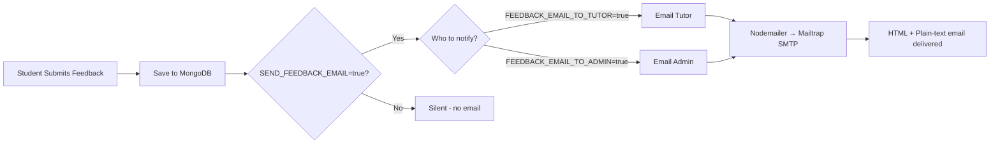

<div align="center">

# 🎓 Quality Education Platform

### A Web-Based Peer Learning and Tutoring Platform for School Students


</div>

---

## 1. Project Overview

**Quality Education** is a comprehensive full-stack web application that connects school students with qualified tutors, providing peer-learning and structured tutoring sessions. The platform enables:

- **Students** to request academic help with automatic Sinhala-to-English translation
- **Tutors** to create and manage tutoring sessions with Google Calendar integration
- **Administrators** to monitor platform activities and manage content
- **Collaborative Learning** through study material sharing, progress tracking, and feedback systems

### Key Capabilities:
- 🔐 Role-based access control (Student, Tutor, Admin)
- 💬 Real-time messaging with AI-powered translation
- 📚 Study material management with cloud storage
- 📅 Tutoring session scheduling with calendar integration
- ⭐ Feedback and rating system with email notifications
- 📊 Student progress tracking and analytics
- 🌍 Multi-language support (Sinhala ↔ English)


---

## 2. Tech Stack

### Frontend Technologies
| Layer | Technology | Purpose |
|-------|-----------|---------|
| **Framework** | React 19 | UI library with latest features |
| **Build Tool** | Vite 5.4 | Fast development and optimized builds |
| **Styling** | Tailwind CSS 4.2 | Utility-first CSS framework |
| **Routing** | React Router DOM 7 | Client-side routing |
| **HTTP Client** | Axios 1.13 | API communication |
| **State Management** | Zustand 5.0 | Lightweight global state |
| **Animations** | Framer Motion 12.38 | Smooth UI animations |
| **Charts** | Recharts 3.8 | Data visualization |
| **Icons** | Lucide React 1.6 | Icon library |
| **Notifications** | React Hot Toast 2.6 | Toast notifications |
| **PDF Export** | jsPDF + html2canvas | Document generation |
| **Date Handling** | date-fns 4.1 | Date utilities |

### Backend Technologies
| Layer | Technology | Purpose |
|-------|-----------|---------|
| **Runtime** | Node.js 22.14 | JavaScript runtime |
| **Framework** | Express.js 5.2 | Web server framework |
| **Database** | MongoDB 7.1 | NoSQL database |
| **ODM** | Mongoose 9.2 | MongoDB object modeling |
| **Authentication** | JWT | Stateless authentication |
| **Password Hashing** | bcryptjs 3.0 | Secure password storage |
| **Validation** | express-validator 7.3 | Input validation |
| **File Upload** | Multer 2.0 | File handling |
| **Cloud Storage** | Cloudinary 1.41 | Image/document storage |
| **Email Service** | Nodemailer 8.0 | SMTP email delivery |
| **AI Translation** | Google Gemini API 0.21 | Sinhala-to-English translation |
| **Calendar** | Google Calendar API | Event scheduling |
| **CORS** | cors 2.8 | Cross-origin requests |
| **Cookies** | cookie-parser 1.4 | Cookie handling |

### Testing & Development
| Tool | Purpose |
|------|---------|
| **Jest 30.3** | Unit and integration testing |
| **Supertest** | HTTP assertion library |
| **MongoMemoryServer** | In-memory MongoDB for tests |
| **Artillery.io** | Performance and load testing |
| **ESLint 9.39** | Code linting (Frontend) |
| **Nodemon** | Auto-restart development server |

---

## 3. System Architecture

### High-Level Architecture Diagram

```
┌─────────────────────────────────────────────────────────────────┐
│                    Client Layer (React)                         │
│  ┌──────────────────────────────────────────────────────────┐  │
│  │  Pages: Auth, Dashboard, Sessions, Materials, Feedback   │  │
│  │  Components: Shared UI, Forms, Cards, Modals            │  │
│  │  State: Zustand Stores, Local Component State           │  │
│  │  Services: Axios API Client, Auth Service              │  │
│  └──────────────────────────────────────────────────────────┘  │
└─────────────────────────────┬──────────────────────────────────┘
                              │ HTTP/REST
                              │ JWT Token
                              │ (via Vite Dev Server)
┌─────────────────────────────▼──────────────────────────────────┐
│                  Express.js API Server                         │
│  ┌──────────────────────────────────────────────────────────┐  │
│  │  API Routes: /api/auth, /api/messages, /api/sessions   │  │
│  │  Middleware: CORS, Auth, Validation, Error Handler     │  │
│  │  Controllers: Business Logic Layer                      │  │
│  │  Services: Data Processing, Integrations               │  │
│  └──────────────────────────────────────────────────────────┘  │
└─────────────────────────────┬──────────────────────────────────┘
                    │          │          │
        ┌───────────┴──────┬───┴────┬────┬─────────┐
        ▼                  ▼        ▼    ▼         ▼
    ┌────────┐      ┌──────────┐ ┌──────────┐ ┌──────────┐
    │MongoDB │      │Cloudinary│ │ Gemini   │ │ Google   │
    │ Atlas  │      │ (Files)  │ │ (AI)     │ │Calendar  │
    └────────┘      └──────────┘ └──────────┘ └──────────┘
        │                                           │
        └───────────────────────┬───────────────────┘
                                │
    ┌───────────────────────────┴────────────────────┐
    │         Mailtrap SMTP (Email Service)          │
    └─────────────────────────────────────────────────┘
```

### Frontend Architecture (React + Vite)

**Folder Structure:**
```
Client/src/
├── components/          # Reusable UI components
├── pages/              # Route-based page components
├── services/           # Axios API client & HTTP utilities
├── stores/             # Zustand global state management
├── context/            # React context for shared data
├── hooks/              # Custom React hooks
├── utils/              # Helper functions and utilities
├── assets/             # Images, fonts, static files
└── __tests__/          # Unit tests, Integration tests, performance tests
```

**Data Flow:**
```
User Interaction → Component State → Zustand Store → API Service 
→ Backend API → Database → Response → Store Update → Re-render
```

### Backend Architecture (Express + MongoDB)

**Folder Structure:**
```
AF_Backend/
├── Controllers/        # Request handlers (logic)
├── services/          # Business logic & integrations
├── models/            # Mongoose schemas
├── Routes/            # API route definitions
├── Middleware/        # Auth, validation, error handling
├── validations/       # Input validation rules
├── utils/             # Helper functions
├── Config/            # Database configuration
├── tests/             # Unit , integration & performance tests
└── uploads/           # Local file storage
```

**Request-Response Flow:**
```
HTTP Request → Route → Middleware (Auth/Validation) → Controller 
→ Service/Model → Database → Response JSON → HTTP Response
```

### Key System Flows

#### 1. Multi-Language Translation Flow
```
Student sends message in any language
→ Detect language automatically (Sinhala, Tamil etc.)
→ Check if language ≠ English
→ Call Google Gemini API for translation to English
→ Store original message + translated version in MongoDB
→ Handle translation errors gracefully (use original if translation fails)
→ Return with translationPerformed flag & detected language
→ Tutors see translated message in English for response
```

**Supported Languages:**
- Sinhala (Unicode 0D80-0DFF)
- Tamil (Unicode 0B80-0BFF)
- Hindi (Unicode 0900-097F)
- English (detected, no translation needed)
- Any other language (auto-detected via API)

#### 2. Tutoring Session Flow
```
Tutor creates session 
→ Validate & save to MongoDB 
→ Create Google Calendar event (auto-invites) 
→ Return session with event ID 
→ Students can join (capacity management) 
→ Feedback after session
```

#### 3. Feedback & Notification Flow
```
Student submits feedback & rating 
→ Validate & save to MongoDB 
→ Compose email (HTML + plain text) 
→ Send via Nodemailer + Mailtrap SMTP 
→ Tutor receives notification
```

#### 4. Study Materials Management Flow
```
Tutor uploads study material with file
→ Validate file (size ≤ 5 MB, supported type)
→ Upload file to Cloudinary
→ Save material metadata to MongoDB
→ Store Cloudinary URL & public ID
→ Return response with material details & URL
→ Students can search, filter, view (views counter incremented)
→ Download & like functionality tracked with metrics
```

### Communication Protocols

- **Frontend ↔ Backend**: REST API over HTTPS, request/response in JSON
- **Client ↔ Database**: Mongoose ODM abstracts MongoDB communication
- **Application ↔ External APIs**: 
  - Google Gemini: REST API (async)
  - Google Calendar: OAuth 2.0
  - Cloudinary: REST API (file upload)
  - Mailtrap: SMTP protocol

---

## 4. Prerequisites

Before setting up the project, ensure you have the following installed:

### System Requirements
- **Operating System**: Windows, macOS, or Linux
- **RAM**: Minimum 4 GB (8 GB recommended)
- **Disk Space**: At least 2 GB available

### Required Software
- **Node.js** v22.14.0 or higher ([Download](https://nodejs.org/))
- **npm** v10.0+ (comes with Node.js) or **yarn**
- **MongoDB** ([Atlas Cloud](https://www.mongodb.com/cloud/atlas) recommended for easy setup)
- **Git** for version control

### Required Accounts & API Keys
1. **MongoDB Atlas** - Free cloud database ([Sign up](https://www.mongodb.com/cloud/atlas))
2. **Google Cloud Project** - For Gemini API, Calendar API, and OAuth
   - Enable: Generative Language API, Google Calendar API
   - Create service account and download JSON key
3. **Cloudinary** - For file storage ([Sign up](https://cloudinary.com/))
4. **Mailtrap** - For email testing ([Sign up](https://mailtrap.io/))
5. **Google OAuth Credentials** - For third-party authentication

### Recommended Tools
- **VS Code** - Code editor
- **Postman** - API testing
- **MongoDB Compass** - Database GUI (optional)
- **Thunder Client** - VS Code API testing extension

---

## 5. Setup Instructions

### Clone the Repository

```bash
git clone https://github.com/sankamaduwantha/Application_Framework_Backend.git
cd Application_Framework_Backend
```

### Backend Setup

#### Step 1: Install Dependencies

```bash
# Navigate to backend directory (if not already there)
cd AF_Backend

# Install backend dependencies
npm install
```

#### Step 2: Configure Environment Variables

Create a `.env` file in the root directory with all required variables (see Section 6 below).

#### Step 3: Start MongoDB

**Option A: Using MongoDB Atlas (Recommended)**
- Create a free cluster at [MongoDB Atlas](https://www.mongodb.com/cloud/atlas)
- Get connection string from cluster settings

**Option B: Using Local MongoDB**
```bash
# macOS with Homebrew
brew services start mongodb-community

# Windows (if installed)
mongod
```

#### Step 4: Start Backend Server

```bash
# Development mode (with hot reload)
npm run dev

# Production mode
npm start
```

Expected output:
```
MongoDB Connected: cluster0.xxxxx.mongodb.net
Server running on port 5000
```

### Frontend Setup

#### Step 1: Install Dependencies

```bash
# Navigate to frontend directory
cd Client

# Install frontend dependencies
npm install
```

#### Step 2: Configure Environment Variables

Create a `.env.local` file in the `Client` directory:

```
VITE_API_URL=http://localhost:5000
```

#### Step 3: Start Development Server

```bash
# Start Vite dev server
npm run dev

# The app will automatically open at http://localhost:5173
```

#### Step 4: Build for Production

```bash
# Create optimized production build
npm run build

# Preview production build locally
npm run preview
```

### Verify Both Servers are Running

- **Frontend**: http://localhost:5173
- **Backend**: http://localhost:5000
- **Health Check**: GET http://localhost:5000/ should return welcome message

---

## 6. Environment Variables

### Backend Environment Variables (.env)


```

### Frontend Environment Variables (.env.local)

Create `.env.local` file in the `Client` directory:

```bash
# ============ API Configuration ============
VITE_API_URL=http://localhost:5000

# ============ Optional: Third-party Keys ============
# VITE_GOOGLE_CLIENT_ID=your_google_client_id_for_oauth
```

### How to Obtain Environment Variables

#### MongoDB URI
1. Go to [MongoDB Atlas](https://www.mongodb.com/cloud/atlas)
2. Create a cluster → Connect → Copy connection string
3. Replace `<password>` with your database user password

#### Google Gemini API Key
1. Visit [Google AI Studio](https://aistudio.google.com/app/apikey)
2. Create new API key
3. Copy and paste in `.env`

#### Cloudinary Credentials
1. Sign up at [Cloudinary](https://cloudinary.com/)
2. Get credentials from Dashboard → Settings → API Keys

#### Mailtrap Credentials
1. Sign up at [Mailtrap](https://mailtrap.io/)
2. Create inbox
3. Get SMTP credentials from inbox settings

---

## 7. API Endpoint Documentation

All API endpoints require `Authorization: Bearer <token>` header except for auth endpoints.

### Authentication Endpoints

#### Register User

```http
POST /api/auth/register
Content-Type: application/json

{
  "fullName": "John Doe",
  "email": "john@example.com",
  "password": "password123",
  "phoneNumber": "0771234567",
  "location": "Colombo",
  "role": "user"
}
```

**Response (201)**
```json
{
  "msg": "User Created Successfully"
}
```

#### Register Tutor

```http
POST /api/auth/register
Content-Type: application/json

{
  "fullName": "Dr. Jane Smith",
  "email": "jane@example.com",
  "password": "password123",
  "phoneNumber": "0771234567",
  "location": "Colombo",
  "role": "tutor",
  "subjects": ["Mathematics", "Physics"],
  "tutorProfile": {
    "bio": "5 years experience",
    "experience": 5,
    "hourlyRate": 2000
  }
}
```

#### Login

```http
POST /api/auth/login
Content-Type: application/json

{
  "email": "john@example.com",
  "password": "password123"
}
```

**Response (200)**
```json
{
  "msg": "User logged in",
  "token": "eyJhbGciOiJIUzI1NiIsInR5cCI6IkpXVCJ9...",
  "user": {
    "role": "user",
    "name": "John Doe",
    "email": "john@example.com"
  }
}
```

#### Logout

```http
POST /api/auth/logout
```

### Message Endpoints (Help Requests with Translation)[IT23472020]

#### Create Message

```http
POST /api/messages
Content-Type: application/json
Authorization: Bearer <token>

{
  "title": "රසායන විද්‍යා සංකල්ප ප්‍රශ්නය",
  "message": "පහත දැක්වෙන අසමතුලිත රසායනික සමීකරණය සලකා බලන්න. මෙය නිවැරදිව තුලිත කර (Balance කර), ලැබෙන පූර්ණ සංඛ්‍යා සංගුණක (Coefficients) සඳහන් කරන්න.",
  "category": "Chemistry",
  "language": "Sinhala"
}
```

**Response (201)**
```json
{
  "success": true,
  "message": "Message created successfully",
  "data": {
    "_id": "507f1f77bcf86cd799439011",
    "title": "Chemistry Concepts Question",
    "message": "Consider the following unbalanced chemical equation. Correctly balance it, and state the resulting integer coefficients.",
    "category": "chemistry",
    "createdBy": {
      "_id": "507f1f77bcf86cd799439012",
      "fullName": "sanka"
    },
    "createdAt": "2026-04-12T10:30:00.000Z"
  },
  "translationPerformed": true
}
```

#### Get All Messages

```http
GET /api/messages
Authorization: Bearer <token>
```

#### Update Message

```http
PUT /api/messages/:id
Content-Type: application/json
Authorization: Bearer <token>

{
  "title": "රසායන විද්‍යා සංකල්ප ප්‍රශ්නය",
  "message": "පහත දැක්වෙන අසමතුලිත රසායනික සමීකරණය සලකා බලන්න. මෙය නිවැරදිව තුලිත කර (Balance කර), ලැබෙන පූර්ණ සංඛ්‍යා සංගුණක (Coefficients) සඳහන් කරන්න.",
  "category": "Science",
  "language": "Sinhala"
}
```

#### Delete Message

```http
DELETE /api/messages/:id
Authorization: Bearer <token>
```

### Study Materials Endpoints

#### Upload Material

```http
POST /api/materials
Content-Type: multipart/form-data
Authorization: Bearer <token>

Form Data:
- title: "Linear Algebra Basics"
- description: "Comprehensive guide to linear algebra"
- subject: "Mathematics"
- grade: "Grade 11"
- file: [PDF file]
- tags: ["algebra", "matrices"]
```

#### Get All Materials

```http
GET /api/materials?subject=Mathematics&grade=Grade%2011&sort=latest&page=1&limit=10
Authorization: Bearer <token>
```

#### Get My Uploads

```http
GET /api/materials/my
Authorization: Bearer <token>
```

#### Get Single Material

```http
GET /api/materials/:id
Authorization: Bearer <token>
```

#### Update Material

```http
PATCH /api/materials/:id
Content-Type: multipart/form-data
Authorization: Bearer <token>

Form Data:
- title: "Updated Title" (optional)
- file: [new PDF file] (optional)
```

#### Delete Material

```http
DELETE /api/materials/:id
Authorization: Bearer <token>
```

#### Record Download

```http
POST /api/materials/:id/download
Authorization: Bearer <token>
```

#### Like/Unlike Material

```http
POST /api/materials/:id/like
Authorization: Bearer <token>
```

### Tutoring Sessions Endpoints

#### Create Session

```http
POST /api/tutoring-sessions
Content-Type: application/json
Authorization: Bearer <token>

{
  "title": "Calculus for Beginners",
  "description": "Learn calculus from scratch",
  "subject": "Mathematics",
  "grade": "Grade 12",
  "date": "2026-05-15",
  "startTime": "14:00",
  "endTime": "16:00",
  "maxCapacity": 20,
  "isOnline": true,
  "meetingLink": "https://zoom.us/j/123456789"
}
```

**Response (201)**
```json
{
  "success": true,
  "message": "Tutoring session created successfully",
  "data": {
    "_id": "507f1f77bcf86cd799439011",
    "title": "Calculus for Beginners",
    "subject": "Mathematics",
    "tutor": {
      "_id": "507f1f77bcf86cd799439012",
      "fullName": "Dr. Jane Smith"
    },
    "date": "2026-05-15T00:00:00.000Z",
    "startTime": "14:00",
    "endTime": "16:00",
    "maxCapacity": 20,
    "enrolledStudents": [],
    "availableSpots": 20,
    "googleCalendarEventId": "abc123xyz"
  },
  "googleCalendarEvent": "Event created successfully"
}
```

#### Get All Sessions

```http
GET /api/tutoring-sessions?subject=Mathematics&grade=Grade%2012&available=true&sort=latest
Authorization: Bearer <token>
```

#### Get My Sessions

```http
GET /api/tutoring-sessions/my-enrolled
Authorization: Bearer <token>
```

#### Get Sessions by Tutor

```http
GET /api/tutoring-sessions/tutor/:tutorId
Authorization: Bearer <token>
```

#### Update Session

```http
PATCH /api/tutoring-sessions/:id
Content-Type: application/json
Authorization: Bearer <token>

{
  "title": "Advanced Calculus",
  "maxCapacity": 25
}
```

#### Delete Session

```http
DELETE /api/tutoring-sessions/:id
Authorization: Bearer <token>
```

#### Join Session

```http
POST /api/tutoring-sessions/:id/join
Authorization: Bearer <token>
```

#### Leave Session

```http
POST /api/tutoring-sessions/:id/leave
Authorization: Bearer <token>
```

### Feedback & Ratings Endpoints

#### Submit Feedback

```http
POST /api/feedbacks
Content-Type: application/json
Authorization: Bearer <token>

{
  "tutorId": "507f1f77bcf86cd799439012",
  "rating": 5,
  "message": "Excellent teaching method!",
  "sessionId": "507f1f77bcf86cd799439011"
}
```

#### Get My Feedbacks

```http
GET /api/feedbacks/me
Authorization: Bearer <token>
```

#### Get Tutor Ratings

```http
GET /api/feedbacks/tutor/:tutorId/ratings
Authorization: Bearer <token>
```

**Response**
```json
{
  "tutorId": "507f1f77bcf86cd799439012",
  "averageRating": 4.7,
  "totalRatings": 15,
  "ratingBreakdown": {
    "5": 12,
    "4": 2,
    "3": 1,
    "2": 0,
    "1": 0
  }
}
```

#### Delete Feedback

```http
DELETE /api/feedbacks/:id
Authorization: Bearer <token>
```

### Progress Tracking Endpoints

#### Create/Update Progress

```http
POST /api/progress
Content-Type: application/json
Authorization: Bearer <token>

{
  "studentId": "507f1f77bcf86cd799439013",
  "topic": "Algebra",
  "completionPercentage": 75,
  "notes": "Student grasps concepts well, needs more practice"
}
```

#### Get My Progress

```http
GET /api/progress/me
Authorization: Bearer <token>
```

#### Get Student Progress

```http
GET /api/progress/student/:studentId
Authorization: Bearer <token>
```

#### Get Tutor's Students Progress

```http
GET /api/progress/tutor/:tutorId
Authorization: Bearer <token>
```

---

## 8. Database Models

### User Model
```javascript
{
  _id: ObjectId,
  fullName: String (3-50 chars),
  email: String (unique),
  password: String (bcrypt hashed),
  phoneNumber: String (10 digits),
  location: String,
  role: Enum ["user", "tutor", "admin"],
  grade: String,
  subjects: [String], // For tutors
  tutorProfile: {
    bio: String,
    experience: Number,
    hourlyRate: Number,
    languages: [String],
    qualifications: [{
      degree: String,
      institution: String,
      year: Number
    }]
  },
  googleId: String, // For OAuth login
  createdAt: Date,
  updatedAt: Date
}
```

### Message Model
```javascript
{
  _id: ObjectId,
  title: String,
  message: String (original or translated),
  category: String,
  createdBy: ObjectId (ref: User),
  requiresTranslation: Boolean,
  translationStatus: String,
  createdAt: Date,
  updatedAt: Date
}
```

### Study Material Model
```javascript
{
  _id: ObjectId,
  title: String,
  description: String,
  subject: String,
  grade: String,
  fileUrl: String (Cloudinary URL),
  filePublicId: String,
  uploader: ObjectId (ref: User),
  tags: [String],
  status: Enum ["active", "archived", "pending"],
  metrics: {
    views: Number,
    downloads: Number,
    likes: Number
  },
  likedBy: [ObjectId], // Hidden in API responses
  createdAt: Date,
  updatedAt: Date
}
```

### Tutoring Session Model
```javascript
{
  _id: ObjectId,
  title: String,
  description: String,
  subject: String,
  grade: String,
  tutor: ObjectId (ref: User),
  date: Date,
  startTime: String (HH:MM),
  endTime: String (HH:MM),
  maxCapacity: Number,
  enrolledStudents: [ObjectId],
  availableSpots: Number,
  status: Enum ["scheduled", "ongoing", "completed", "cancelled"],
  isOnline: Boolean,
  meetingLink: String,
  location: String,
  googleCalendarEventId: String,
  createdAt: Date,
  updatedAt: Date
}
```

### Feedback Model
```javascript
{
  _id: ObjectId,
  student: ObjectId (ref: User),
  tutor: ObjectId (ref: User),
  session: ObjectId (ref: TutoringSession, optional),
  rating: Number (1-5),
  message: String,
  createdAt: Date,
  updatedAt: Date
  // Unique index on: student + tutor + session
}
```

### Progress Model
```javascript
{
  _id: ObjectId,
  student: ObjectId (ref: User),
  tutor: ObjectId (ref: User),
  topic: String,
  completionPercentage: Number (0-100),
  notes: String,
  createdAt: Date,
  updatedAt: Date
}
```

---

## 9. Architecture & Patterns

### Design Patterns Used

#### MVC (Model-View-Controller)
- **Models**: Mongoose schemas in `/models` folder
- **Controllers**: Route handlers in `/Controllers` folder  
- **Views**: React components in `/Client/src/components`
- **Routes**: Express routes in `/Routes` folder

#### Service Layer Pattern
- Business logic separated into `/services` folder
- Controllers delegate to services
- Services handle data transformation, validation, and external API calls
- Example: `feedbackMailService.js`, `messageService.js`, `tutoringSessionService.js`

#### Middleware Pattern
- Authentication: `authMiddleware.js` - JWT verification
- Validation: `studyMaterialValidation.js`, `tutoringSessionValidator.js`
- Error Handling: `errorHandler.js` - Global error catching
- File Upload: `uploadMiddleware.js` - Multer + Cloudinary integration

#### Repository Pattern (Implicit)
- Mongoose models act as data access layer
- Centralized database queries
- Reduces code duplication

### Code Organization

```
Frontend (React):
- Presentational Components: Reusable UI (buttons, cards, modals)
- Container Components: Data-fetching logic (pages)
- Services: API client abstraction
- Stores: Global state management (Zustand)
- Utils: Helper functions

Backend (Node.js):
- Controllers: HTTP request/response handling
- Services: Business logic and external integrations
- Models: Database schema definitions
- Routes: URL routing and HTTP method mapping
- Middleware: Cross-cutting concerns (auth, logging, error)
- Utils: Helper functions and utilities
- Validations: Input validation rules
```

### Error Handling Strategy

**Backend:**
- Custom error classes with descriptive messages
- Global error handler middleware
- Consistent JSON error responses
- Status codes: 400 (Bad Request), 401 (Unauthorized), 403 (Forbidden), 404 (Not Found), 500 (Server Error)

**Frontend:**
- Axios interceptors for global error handling
- Toast notifications for user feedback
- Graceful error recovery
- User-friendly error messages

### Security Practices

| Feature | Implementation |
|---------|-----------------|
| Password Security | bcrypt hashing (salt rounds: 10) |
| Authentication | JWT tokens in HTTP-only cookies |
| Authorization | Role-based middleware protection |
| Input Validation | express-validator on all inputs |
| CORS | Restricted to frontend domain |
| NoSQL Injection | Input sanitization, parameterized queries |
| Rate Limiting | (Can be added with express-rate-limit) |
| HTTPS | Required in production |

---

## 10. Third-Party Integrations

### Google Gemini API (Multi-Language AI Translation)
**Purpose:** Translate any language (Sinhala, Tamil etc.) to English

**Supported Languages:**
- Sinhala (0D80–0DFF) → English
- Tamil (0B80–0BFF) → English
- Hindi (0900–097F) → English
- Any other language → Translated to English via Gemini API

**Integration Points:**
- `/services/messageService.js` - `processMessageFieldsByLanguage()` & `createMessageWithTranslation()`
- Main functions:
  - `processMessageFieldsByLanguage(title, message, formUILanguage)` - Process & translate title+message based on language
  - `createMessageWithTranslation(messageData, userData, formUILanguage, fileData)` - Create message with translation support
  - `translateToEnglish(text, sourceLanguage)` - Core translation with retry logic (max 1 retry with exponential backoff)
  - `containsSinhalaCharacters(text)` - Check for Sinhala Unicode range (0D80–0DFF)
  - `containsTamilCharacters(text)` - Check for Tamil Unicode range (0B80–0BFF)
- Language parameter supports: "Sinhala", "Tamil", "Hindi", or any language string (auto-detected by Gemini)
- 10-second timeout for translation requests
- Automatic retry on network errors (503, timeout, ECONNRESET) with exponential backoff (max delay: 10s)
- Graceful fallback: Returns original text with `requiresTranslation: true` if translation fails
- Response includes: `translationPerformed` flag and translated title+message
- Batch processing: Translates title & message in parallel using `Promise.all()`
- Error handling: Specific error messages for quota limits, timeouts, and API key issues

**Setup:**
1. Create Google Cloud project
2. Enable Generative Language API
3. Generate API key from AI Studio
4. Add to `.env` as `GEMINI_API_KEY`

**Performance & Error Handling:**
- Automatic retry on transient errors (up to 1 retry with exponential backoff: 2s → 10s max)
- Distinguishes between retryable errors (503, timeout) and non-retryable (429 quota, 403 forbidden)
- Specific error messages for quota limits, API key issues, and timeouts
- Batch translation: Title & message translated in parallel (faster than sequential)
- Recommendation: Implement caching for frequently translated phrases to reduce API calls

### Google Calendar API (Event Scheduling)
**Purpose:** Auto-create calendar events for tutoring sessions

**Integration Points:**
- `/services/googleCalendarService.js`
- `/Controllers/tutoringSessionController.js` - Session creation
- Creates events, fetches availability, updates events

**Setup:**
1. Create Google Cloud project
2. Enable Google Calendar API
3. Create OAuth 2.0 credentials (service account)
4. Download JSON key file
5. Add credentials to `.env`

### Cloudinary (Cloud File Storage)
**Purpose:** Store and manage study material files

**Integration Points:**
- `/Middleware/uploadMiddleware.js` - File upload config
- `/services/studyMaterialService.js` - File management
- Supports: PDF, DOC, DOCX, PPT, PPTX, TXT, images (max 5 MB)

**Features:**
- Auto-delete old file when updating
- Atomic transactions (rollback on DB failure)
- URL transformations (thumbnails, optimization)

**Setup:**
1. Sign up at Cloudinary
2. Get cloud name, API key, API secret
3. Add to `.env`

### Mailtrap (Email Service)
**Purpose:** Send feedback notifications to tutors and admins

**Integration Points:**
- `/services/feedbackMailService.js` - Email composition
- `/Controllers/feedbackEmailController.js` - Email triggering
- Nodemailer SMTP integration

**Features:**
- HTML + plain text emails
- Dynamic template rendering
- Error logging and retry logic

**Setup:**
1. Sign up at Mailtrap
2. Create inbox
3. Get SMTP credentials
4. Add to `.env` (MAIL_HOST, MAIL_PORT, MAIL_USER, MAIL_PASS)

---

## 11. Testing Instructions

### Unit Tests

Unit tests focus on individual functions and services without external dependencies.

```bash
# Run all unit tests
npm run test:unit

# Run specific component tests
npm run test:unit:messages     # Help request messages (Sinhala/Tamil translation)
npm run test:unit:sessions    # Tutoring sessions
npm run test:unit:feedback    # Feedback & ratings
npm run test:unit:progress    # Student progress
```

**Help Request Message Unit Tests Flow:**

The message controller tests verify the complete help request workflow including multi-language translation and authorization:

```bash
# Test: deleteMessage Controller
✅ Success Cases:
  - Message deleted successfully (status 200, success message)
  - Returns confirmation with "Message deleted successfully"

❌ Error Cases:
  - Message not found (status 400, "Message not found")
  - User not authorized to delete (status 400, "You are not authorized to delete this message")
  - Database query fails (status 500, with error details)
  - Deletion operation fails (status 500, with error details)

# Test: createMessage with Translation
✅ Success Cases:
  - Sinhala message translated to English (translationPerformed: true)
  - Tamil message translated to English (translationPerformed: true)
  - English message stored as-is (translationPerformed: false)

❌ Error Cases:
  - Translation timeout (10-second limit exceeded)
  - Translation quota exceeded (returns original message gracefully)
  - API key missing (throws configuration error)
  - Invalid language format (bad request)

# Test Coverage:
- Sinhala character detection (Unicode 0D80–0DFF)
- Tamil character detection (Unicode 0B80–0BFF)
- Batch translation (title + message in parallel)
- Retry logic with exponential backoff
- Authorization checks (message creator verification)
```

**Test Files Location:**
- `/tests/unit/` directory
- Technologies: Jest, Mock functions

### Integration Tests

Integration tests verify complete API workflows with real database (MongoDB in Memory).

```bash
# Run all integration tests
npm run test:integration

# Run specific test suites
npm run test:integration:help-request  # Help request messages API (POST /api/messages)
npm run test:integration:sessions      # Tutoring sessions API
npm run test:integration:feedback      # Feedback API
npm run test:integration:progress      # Progress tracking API
```

**Help Request Integration Tests Flow (POST /api/messages):**

The message API integration tests verify the complete POST endpoint workflow with real database (MongoDB in Memory):

```bash
# Test: POST /api/messages — Help Request Endpoint

✅ Success Cases:
  1. Responds to POST request with sample message data
     - Accepts title, message, category, language fields
     - Returns valid HTTP status code (2xx, 4xx, or 5xx)
     - Response body contains expected data structure

  2. Status code validation
     - Returns 200, 201, 400, 401, or 403
     - Properly indicates success or error condition

  3. Accepts different message categories
     - Mathematics, Science, IT & Programming, English, Other
     - Each category returns valid status code

  4. Request body processing
     - Processes JSON payload correctly
     - Returns structured response object

✅ Multi-Language Support:
  - English messages stored directly (no translation)
  - Sinhala messages detected & translated to English (translationPerformed: true)
  - Tamil messages detected & translated to English (translationPerformed: true)

# Test Coverage:
- Authenticated requests (JWT token validation)
- Database persistence (MongoDB in Memory)
- Language detection & translation mocking
- Category validation across all supported subjects
- Response structure validation
- HTTP status code verification
- File upload handling (image optional)

# Workflow:
1. Create test user & generate JWT token
2. Connect to test MongoDB instance
3. Send POST request with message data + auth token
4. Mock Google Gemini translation service
5. Verify response status and body
6. Cleanup database after test
```

**Test Files Location:**
- `/tests/integration/` directory
- Technologies: Jest, Supertest, MongoMemoryServer

### Performance Tests

Performance tests simulate load with multiple concurrent users using Artillery.io.

```bash
# Generate authentication token for testing
npm run test:perf:helprequest:token

# Run load test
npm run test:perf:helprequest

# Generate detailed HTML report
npm run test:perf:helprequest:report
```

**Available Performance Tests:**
```bash
npm run test:perf:helprequest      # Help request endpoints
npm run test:perf:sessions         # Tutoring sessions endpoints
npm run test:perf:feedback         # Feedback endpoints
npm run test:perf:progress         # Progress tracking endpoints
npm run perf:load                  # Baseline load test
npm run perf:rampup                # Ramp-up test
npm run perf:spike                 # Spike test
npm run perf:stress                # Stress test
```

### Code Coverage

```bash
# Generate coverage report
npm run test:coverage

# Reports created in: /tests/coverage/
# View HTML report: /tests/coverage/index.html
```

### Test Reports

After running tests, reports are generated in:
- **Unit/Integration:** Console output
- **Performance:** HTML reports in `/tests/performance/` directory
- **Coverage:** HTML report in `/tests/coverage/`

---

## 12. Deployment Guide

### Backend Deployment (Render.com or Heroku)

#### Using Render.com

1. **Create Render Account**
   - Sign up at [Render](https://render.com/)

2. **Prepare Environment**
   ```bash
   # Create Procfile in root (if needed)
   echo "web: node server.js" > Procfile
   ```

3. **Deploy**
   - Connect GitHub repository
   - Select "New Web Service"
   - Choose Node.js runtime
   - Environment: Set all `.env` variables

4. **Health Check**
   ```bash
   curl https://your-backend.onrender.com/
   ```

#### Using Heroku

1. **Install Heroku CLI**
   ```bash
   npm install -g heroku
   ```

2. **Login & Create App**
   ```bash
   heroku login
   heroku create your-app-name
   ```

3. **Set Environment Variables**
   ```bash
   heroku config:set MONGO_URI=your_uri
   heroku config:set JWT_SECRET=your_secret
   # ... set all other variables
   ```

4. **Deploy**
   ```bash
   git push heroku main
   ```

### Frontend Deployment (Vercel or Netlify)

#### Using Vercel

1. **Install Vercel CLI**
   ```bash
   npm install -g vercel
   ```

2. **Deploy from Client Directory**
   ```bash
   cd Client
   vercel
   ```

3. **Configure Environment**
   - Set `VITE_API_URL` to your backend URL
   - Update in Vercel dashboard settings

#### Using Netlify

1. **Install Netlify CLI**
   ```bash
   npm install -g netlify-cli
   ```

2. **Deploy**
   ```bash
   cd Client
   npm run build
   netlify deploy --prod --dir=dist
   ```

3. **Configure**
   - Add `VITE_API_URL` in environment variables
   - Set redirect rules for React Router

### Production Checklist

- [ ] Enable HTTPS on all domains
- [ ] Set `NODE_ENV=production`
- [ ] Update `FRONTEND_URL` and `PRODUCTION_URL` in backend `.env`
- [ ] Configure CORS for production domain
- [ ] Set up database backups
- [ ] Configure error logging (Sentry, LogRocket)
- [ ] Enable rate limiting on APIs
- [ ] Set up monitoring and alerts
- [ ] Test all payment flows (if applicable)
- [ ] Review security headers (CORS, CSP, XSS protection)

---

## 13. Troubleshooting

### Common Issues & Solutions

#### Backend won't connect to MongoDB

**Error:** `MongoDB connection failed`

**Solutions:**
```bash
# 1. Check MONGO_URI in .env
echo $MONGO_URI

# 2. Verify database credentials are correct
# 3. Check if IP is whitelisted in MongoDB Atlas
# 4. Test with MongoDB Compass using connection string
# 5. Restart MongoDB service
```

#### Port 5000 already in use

**Error:** `EADDRINUSE: address already in use :::5000`

**Solutions:**
```bash
# On Windows
netstat -ano | findstr :5000
taskkill /PID <PID> /F

# On macOS/Linux
lsof -i :5000
kill -9 <PID>
```

#### Frontend can't call backend API

**Error:** `CORS error` or `Failed to fetch`

**Solutions:**
1. Verify backend is running on port 5000
2. Check `VITE_API_URL` is correct in `.env.local`
3. Verify CORS is enabled in `server.js`
4. Check for typos in API routes

#### Translation Service isn't working

**Error:** `Gemini API error` or `Translation failed` in console

**Solutions:**
```bash
# 1. Verify GEMINI_API_KEY is correct in .env
# 2. Check if Generative Language API is enabled in Google Cloud console
# 3. Check request quota hasn't been exceeded (free tier has limits)
# 4. Verify message contains text in supported language (Sinhala, Tamil, Hindi, etc.)
# 5. Check translation timeout (default: 10 seconds) - may be too slow on poor connection
# 6. Check retry logic: Automatic retries on network errors (max 1 retry)
```

**Supported Languages for Auto-Translation:**
- Sinhala (0D80–0DFF Unicode range)
- Tamil (0B80–0BFF Unicode range)
- Hindi (0900–097F Unicode range)
- Any language (Gemini API auto-detects language)

#### Cloudinary uploads fail

**Error:** `Cloudinary upload failed`

**Solutions:**
1. Verify `CLOUDINARY_CLOUD_NAME`, `CLOUDINARY_API_KEY`, `CLOUDINARY_API_SECRET`
2. Check file size (max 5 MB)
3. Check file type is supported
4. Verify folder/resource type settings in Cloudinary

#### Email notifications not sending

**Error:** `Mailtrap SMTP error`

**Solutions:**
```bash
# 1. Verify MAIL_HOST, MAIL_PORT, MAIL_USER, MAIL_PASS
# 2. Check SEND_FEEDBACK_EMAIL is true
# 3. Test SMTP credentials with Mailtrap UI
# 4. Check spam folder in inbox
```

#### Jest tests timing out

**Error:** `Jest timeout exceeded`

**Solutions:**
```bash
# Increase timeout
npm run test:unit -- --testTimeout=50000

# Or check for unresolved promises in tests
# Ensure all async operations complete
```

---

## 14. Contributors

This project was developed by a team of computer science students:

| Component | Developer | Student ID | Features |
|-----------|-----------|-----------|----------|
| **Authentication** | H A S Maduwantha | IT23472020 | User registration, Login, JWT auth, RBAC |
| **Help Requests** | H A S Maduwantha | IT23472020 | Message CRUD, Multi language  translation (Gemini AI) |
| **Study Materials** | ALAHAKOON PB | IT23405240 | Upload, Search, Filter, Like, Download, Cloudinary integration |
| **Tutoring Sessions** | SERASINGHE CS | IT23401976 | Create/manage sessions, Google Calendar integration, Capacity management |
| **Feedback & Progress** | NIMADITH LMH | IT23242272 | Ratings, Feedback, Progress tracking, Email notifications (Mailtrap) |
| **Frontend** | Team | All | React dashboard, UI components, State management |

### Contributing

To contribute to this project:

1. Fork the repository
2. Create a feature branch: `git checkout -b feature/amazing-feature`
3. Commit changes: `git commit -m 'Add amazing feature'`
4. Push to branch: `git push origin feature/amazing-feature`
5. Open a Pull Request

### License

This project is licensed under the MIT License - see LICENSE file for details.

### Support

For issues, questions, or suggestions:
1. Create an issue on GitHub
2. Contact the development team
3. Check documentation in `/docs` (if available)

---

**Last Updated:** April 2026  
**Repository:** [Quality-Education](https://github.com/ChiranLK/Quality-Education)  
**Status:** Active Development

---

## � Quick Start Testing 

### For Developers: First Time Running Tests?

**Time to Complete: ~10 minutes**

#### Step 1: Install Dev Dependencies ✅

```bash
# Skip this if already installed
npm install
```

#### Step 2: Run Unit Tests (Fastest - ~2 minutes)

```bash
# Test all components
npm run test:unit

# Or test specific component
npm run test:unit:sessions
```

**What you'll see:**
- ✅ Green checkmarks = tests passed
- ❌ Red X = test failed (check console for error details)

---

#### Step 3: Run Integration Tests (Medium - ~5 minutes)

```bash
# Test API endpoints
npm run test:integration

# Or test specific endpoints
npm run test:integration:sessions
```

**What's being tested:**
- API endpoint responses (200, 400, 403, 404)
- Database operations
- Authentication and authorization
- Error handling

---

#### Step 4: Run Performance Tests (Optional - ~5 minutes)

```bash
# Terminal 1: Start backend
npm run dev

# Terminal 2: Generate token and run performance test
npm run test:perf:helprequest:token
# Copy token from output into tests/performance/help-request-load-test.yml

npm run test:perf:helprequest

# Open generated report
tests/performance/helprequest-report.html
```

---

### 📊 All Testing Commands at a Glance

```bash
# Unit Tests
npm run test:unit                          # All unit tests
npm run test:unit:sessions                 # Tutoring sessions only

# Integration Tests  
npm run test:integration                   # All integration tests
npm run test:integration:sessions          # Tutoring sessions only

# Code Coverage
npm run test:coverage                      # Generate coverage report

# Performance Tests
npm run test:perf:token                    # Study materials tokens
npm run test:perf                          # Study materials load test
npm run test:perf:run                      # With JSON output
npm run test:perf:report                   # Generate HTML report

npm run test:perf:sessions:token           # Tutoring sessions tokens
npm run test:perf:sessions                 # Load test
npm run test:perf:sessions:run             # With JSON output
npm run test:perf:sessions:report          # Generate HTML report

npm run test:perf:helprequest:token        # Help request tokens
npm run test:perf:helprequest              # Load test
npm run test:perf:helprequest:run          # With JSON output
npm run test:perf:helprequest:report       # Generate HTML report
```

---

## 🏗️ Component Testing Strategy

This table shows which testing layers cover each component:

| Component | Developer | Unit Tests | Integration Tests | Performance Tests |
|-----------|-----------|:----------:|:----------------:|:----------------:|
| **Authentication** | IT23472020 | ✅ | ✅ | ✅ |
| **Help Requests (Messages)** | IT23472020 | ✅ | ✅ | ✅ Artillery |
| **Study Materials** | IT23405240 | ✅ | ✅ | ✅ Artillery |
| **Tutoring Sessions** | IT23401976 | ✅ | ✅ | ✅ Artillery |
| **Google Calendar** | IT23401976 | ✅ | ✅ | ✅ (Mocked) |
| **Feedback & Ratings** | IT23242272 | ✅ | ✅ | ✅ (in integration) |
| **Student Progress** | IT23242272 | ✅ | ✅ | ✅ (in integration) |
| **Email Notifications** | IT23242272 | ✅ | ✅ | ✅ (Mocked) |

**Legend:**
- ✅ = Fully tested
- ✅ (Mocked) = External APIs are mocked to avoid real calls
- ✅ Artillery = Load tested with Artillery.io

---

## 📌 Test Coverage by Scenario

### Scenario 1: Student Creates & Updates Help Request (Multi-Language Support)

**Flow:**
1. Student registers
2. Student creates help request in any language (Sinhala, Tamil English, etc.)
3. Message auto-translates to English (Google Gemini API detects language & translates)
4. Student updates message with text in another language (auto-translates again)
5. Student deletes message

**Tested in:**
- ✅ Unit: `messageService.test.js` (language detection, translation logic, retry mechanism)
- ✅ Integration: `helpRequest.test.js` (full workflow + database persistence)
- ✅ Performance: Artillery with 80+ concurrent users creating messages in multiple languages

---

### Scenario 2: Tutor Creates Session & Manages Students

**Flow:**
1. Tutor creates tutoring session
2. Google Calendar event auto-created
3. Multiple students join session
4. Students leave session
5. Tutor updates session details
6. Tutor records student progress
7. Student views their progress

**Tested in:**
- ✅ Unit: `tutoringSessionService.test.js`, `tutoringSessionController.test.js`
- ✅ Integration: `tutoringSession.test.js` (43 test cases)
- ✅ Performance: `tutoring-session-load-test.yml`

---

### Scenario 3: Tutor Uploads Study Materials

**Flow:**
1. Tutor uploads PDF file
2. File stored in Cloudinary
3. Student searches materials by subject
4. Student downloads material (counter increments)
5. Student likes material (toggles)
6. Tutor updates material metadata
7. Admin deletes material

**Tested in:**
- ✅ Unit: `studyMaterialService.test.js`
- ✅ Integration: `studyMaterial.test.js` (30+ API tests)
- ✅ Performance: `study-material-load-test.yml`
- 📋 Postman: `StudyMaterials_Complete.postman_collection.json` (30 API tests)

---

### Scenario 4: Student Provides Feedback to Tutor

**Flow:**
1. Student submits rating (1-5 stars) for tutor
2. Email notification sent to tutor and admin
3. Tutor views all feedback received
4. Student views feedback they submitted
5. Admin can delete any feedback
6. Rating aggregation updated (avg, breakdown by stars)

**Tested in:**
- ✅ Unit: `feedbackController.test.js`
- ✅ Integration: Feedback endpoints in `tutoringSession.test.js`
- ✅ Email: Mocked Nodemailer in tests

---

## 📡 API Endpoints

### 🔐 Authentication Routes

#### 1️⃣ User Registration

**Endpoint:** `POST /api/auth/register`

**Request Body:**
```json
{
  "fullName": "Shani Navodya",
  "email": "shaninavodya@2001gmail.com",
  "password": "shaninavodya@2001",
  "phoneNumber": "0771234568",
  "location": "Weligama"
}
```

**Response:**
```json
{
  "msg": "User Created Successfully"
}
```

**Validation Rules:**
- `fullName`: 3-50 characters
- `email`: Valid email format (unique)
- `password`: Minimum 6 characters
- `phoneNumber`: 10 digits
- `location`: Required

---

#### 2️⃣ Tutor Registration

**Endpoint:** `POST /api/auth/register`

**Request Body:**
```json
{
  "fullName": "Shani",
  "email": "shaninavodya@2002gmail.com",
  "password": "shaninavodya@2002",
  "phoneNumber": "0771234512",
  "location": "Weligama",
  "role": "tutor",
  "subjects": ["Science", "Mathematics", "Physics"]
}
```

**Response:**
```json
{
  "msg": "Tutor registered successfully"
}
```

**Additional Fields (Optional):**
```json
{
  "tutorProfile": {
    "bio": "Experienced tutor with 5 years of teaching",
    "experience": 5,
    "hourlyRate": 2000,
    "languages": ["English", "Sinhala", "Tamil"],
    "qualifications": [
      {
        "degree": "BSc in Mathematics",
        "institution": "University of Colombo",
        "year": 2018
      }
    ]
  }
}
```

---

#### 3️⃣ Admin Registration

**Endpoint:** `POST /api/auth/register`

**Request Body:**
```json
{
  "fullName": "John Doe",
  "email": "john.doe@example.com",
  "password": "password123",
  "phoneNumber": "0771234512",
  "location": "Weligama",
  "role": "admin"
}
```

**Response:**
```json
{
  "msg": "Admin registered successfully"
}
```

---

#### 4️⃣ Login

**Endpoint:** `POST /api/auth/login`

**Request Body:**
```json
{
  "email": "shaninavodya@2001gmail.com",
  "password": "shaninavodya@2001"
}
```

**Response:**
```json
{
  "msg": "User logged in",
  "token": "eyJhbGciOiJIUzI1NiIsInR5cCI6IkpXVCJ9...",
  "user": {
    "role": "user",
    "name": "Shani Navodya",
    "email": "shaninavodya@2001gmail.com"
  }
}
```

---

#### 5️⃣ Logout

**Endpoint:** `POST /api/auth/logout`

**Response:**
```json
{
  "msg": "User logged out"
}
```

---

### 💬 Message Routes (Help Requests)

#### 1️⃣ Create Message (with Translation)

**Endpoint:** `POST /api/messages`

**Headers:**
```json
{
  "Authorization": "Bearer <token>",
  "Content-Type": "application/json"
}
```

**Request Body:**
```json
{
  "title": "රසායන විද්‍යා සංකල්ප ප්‍රශ්නය",
  "message": "පහත දැක්වෙන අසමතුලිත රසායනික සමීකරණය සලකා බලන්න. මෙය නිවැරදිව තුලිත කර (Balance කර), ලැබෙන පූර්ණ සංඛ්‍යා සංගුණක (Coefficients) සඳහන් කරන්න.",
  "category": "Chemistry",
  "language": "English"
}
```

**Response:**
```json
{
  "success": true,
  "message": "Message created successfully",
  "data": {
    "_id": "507f1f77bcf86cd799439011",
    "title": "Chemistry Concepts Question",
    "message": "Consider the following unbalanced chemical equation. Correctly balance it, and state the resulting integer coefficients.",
    "category": "chemistry",
    "createdBy": {
      "_id": "507f1f77bcf86cd799439012",
      "fullName": "sanka"
    },
    "createdAt": "2026-04-12T10:30:00.000Z"
  },
  "translationPerformed": true
}
```

---

#### 2️⃣ Get All Messages

**Endpoint:** `GET /api/messages`

**Headers:**
```json
{
  "Authorization": "Bearer <token>"
}
```

**Response:**
```json
{
            "_id": "69dafcceed23bb3b3c1b3d64",
            "createdBy": {
                "_id": "69d896b4e3578abed71c0091",
                "fullName": "sanka",
                "email": "it23472020@my.sliit.lk",
                "role": "user"
            },
            "title": "Chemistry",
            "message": "Consider the following unbalanced chemical equation. Correctly balance it, and state the resulting integer coefficients.",
            "category": "Science",
            "language": "Sinhala",
            "requiresTranslation": true,
            "image": null,
            "createdAt": "2026-04-12T02:00:46.612Z",
            "updatedAt": "2026-04-12T02:00:46.612Z",
            "__v": 0
        }
```

**Access Control:**
- **Students**: See only their own messages
- **Tutors/Admins**: See all messages

---

#### 3️⃣ Update Message (with Translation)

**Endpoint:** `PUT /api/messages/:id`

**Headers:**
```json
{
  "Authorization": "Bearer <token>",
  "Content-Type": "application/json"
}
```

**Request Body:**
```json
{
  "title": "රසායන විද්‍යා සංකල්ප ප්‍රශ්නය",
  "message": "පහත දැක්වෙන අසමතුලිත රසායනික සමීකරණය සලකා බලන්න. මෙය නිවැරදිව තුලිත කර (Balance කර), ලැබෙන පූර්ණ සංඛ්‍යා සංගුණක (Coefficients) සඳහන් කරන්න.",
  "category": "Chemistry",
  "language": "English"
}
```

**Response:**
```json
{
  "success": true,
  "msg": "Message updated successfully",
  "message": {
    "_id": "507f1f77bcf86cd799439011",
    "message": "Consider the following unbalanced chemical equation. Correctly balance it, and state the resulting integer coefficients.",
    "requiresTranslation": true,
    "createdBy": {
      "_id": "507f1f77bcf86cd799439012",
      "fullName": "Shani Navodya",
      "email": "shaninavodya@2001gmail.com",
      "role": "user"
    },
    "updatedAt": "2026-02-27T11:00:00.000Z"
  },
  "translationPerformed": true
}
```

---

#### 4️⃣ Delete Message

**Endpoint:** `DELETE /api/messages/:id`

**Headers:**
```json
{
  "Authorization": "Bearer <token>"
}
```

**Response:**
```json
{
  "msg": "Message deleted successfully"
}
```

---

## 📚 Study Materials & Resources API
👨‍💻 Developed by **ALAHAKOON PB** — Student ID: `IT23405240`

> Base URL: `/api/materials` | Auth: `Bearer <token>` required on all routes

### 1️⃣ Upload Study Material

**Endpoint:** `POST /api/materials`  
**Access:** Tutor / Admin only  
**Content-Type:** `multipart/form-data`

| Field | Type | Required | Description |
|---|---|---|---|
| `title` | string | ✅ | 3–150 characters |
| `description` | string | ✅ | 10–2000 characters |
| `subject` | string | ✅ | e.g. `mathematics` |
| `grade` | string | ✅ | e.g. `Grade 9` |
| `file` | file | ✅ | PDF, DOC, DOCX, PPT, PPTX, TXT, image (max 5 MB) |
| `tags` | string | ❌ | JSON array string e.g. `["algebra","equations"]` (max 10) |

**Response:**
```json
{
  "success": true,
  "message": "Study material uploaded successfully",
  "data": {
    "_id": "64f1a2b3c4d5e6f7a8b9c0d1",
    "title": "Introduction to Algebra",
    "subject": "mathematics",
    "grade": "Grade 9",
    "fileUrl": "https://res.cloudinary.com/...",
    "metrics": { "views": 0, "downloads": 0, "likes": 0 },
    "status": "active"
  }
}
```

---

### 2️⃣ Get All Materials (with Filters & Pagination)

**Endpoint:** `GET /api/materials`  
**Access:** All authenticated users

**Query Parameters:**
| Param | Example | Description |
|---|---|---|
| `subject` | `mathematics` | Filter by subject |
| `grade` | `Grade 9` | Filter by grade |
| `status` | `active` | `active` \| `archived` \| `pending` |
| `keyword` | `algebra` | Full-text search (title, description, tags) |
| `sort` | `latest` | `latest` \| `oldest` \| `subject` \| `title` |
| `page` | `1` | Page number (default: 1) |
| `limit` | `10` | Results per page (default: 10, max: 100) |

**Response:**
```json
{
  "success": true,
  "data": [ /* array of materials */ ],
  "pagination": {
    "total": 25,
    "pages": 3,
    "currentPage": 1,
    "limit": 10,
    "hasMore": true
  }
}
```

---

### 3️⃣ Get My Uploads

**Endpoint:** `GET /api/materials/my`  
**Access:** Tutor / Admin only  
Supports same query parameters as Get All.

---

### 4️⃣ Get Single Material

**Endpoint:** `GET /api/materials/:id`  
**Access:** All authenticated users  
⚡ Automatically increments `metrics.views` on every call.

---

### 5️⃣ Update Material

**Endpoint:** `PATCH /api/materials/:id`  
**Access:** Uploader or Admin only  
**Content-Type:** `multipart/form-data`  
All fields optional. Attach a new `file` to replace the existing one (old file auto-deleted from Cloudinary).

---

### 6️⃣ Delete Material

**Endpoint:** `DELETE /api/materials/:id`  
**Access:** Uploader or Admin only  
Deletes from MongoDB **and** removes the file from Cloudinary.

---

### 7️⃣ Record Download

**Endpoint:** `POST /api/materials/:id/download`  
**Access:** All authenticated users  
Increments `metrics.downloads` by 1.

```json
{ "success": true, "message": "Download recorded", "data": { "downloads": 5 } }
```

---

### 8️⃣ Like / Unlike Material

**Endpoint:** `POST /api/materials/:id/like`  
**Access:** All authenticated users  
Toggle — same endpoint likes on 1st call, unlikes on 2nd call. Prevents duplicate likes per user.

```json
{ "success": true, "message": "Material liked", "data": { "likes": 12 } }
```

---

## 📅 Peer Learning & Tutoring Sessions API
👨‍💻 Developed by **SERASINGHE CS** — Student ID: `IT23401976`

> Base URL: `/api/tutoring-sessions` | Auth: `Bearer <token>` required on all routes

### 1️⃣ Create Tutoring Session

**Endpoint:** `POST /api/tutoring-sessions`  
**Access:** Tutor / Admin only  
**Content-Type:** `application/json`

**Request Body:**
```json
{
  "title": "Advanced Mathematics - Calculus",
  "description": "Comprehensive calculus session covering derivatives and integrals",
  "subject": "Mathematics",
  "grade": "Grade 12",
  "date": "2026-03-15",
  "startTime": "14:00",
  "endTime": "16:00",
  "maxCapacity": 25,
  "meetingLink": "https://zoom.us/j/123456789",
  "isOnline": true
}
```

**Response:**
```json
{
  "success": true,
  "message": "Tutoring session created successfully",
  "data": {
    "_id": "64f1a2b3c4d5e6f7a8b9c0d1",
    "title": "Advanced Mathematics - Calculus",
    "subject": "Mathematics",
    "grade": "Grade 12",
    "tutor": {
      "_id": "64f1a2b3c4d5e6f7a8b9c0d2",
      "fullName": "John Doe",
      "email": "john@example.com"
    },
    "date": "2026-03-15T00:00:00.000Z",
    "startTime": "14:00",
    "endTime": "16:00",
    "maxCapacity": 25,
    "enrolledStudents": [],
    "availableSpots": 25,
    "status": "scheduled",
    "isOnline": true,
    "meetingLink": "https://zoom.us/j/123456789",
    "googleCalendarEventId": "abc123xyz",
    "createdAt": "2026-02-27T10:00:00.000Z"
  },
  "googleCalendarEvent": "Event created successfully"
}
```

---

### 2️⃣ Get All Tutoring Sessions (with Filters)

**Endpoint:** `GET /api/tutoring-sessions`  
**Access:** All authenticated users

**Query Parameters:**
| Param | Example | Description |
|---|---|---|
| `subject` | `Mathematics` | Filter by subject |
| `grade` | `Grade 12` | Filter by grade |
| `tutor` | `64f1a2b3...` | Filter by tutor ID |
| `status` | `scheduled` | `scheduled` \| `ongoing` \| `completed` \| `cancelled` |
| `date` | `2026-03-15` | Filter by specific date |
| `isOnline` | `true` | Filter online/offline sessions |
| `available` | `true` | Show only sessions with available spots |
| `page` | `1` | Page number (default: 1) |
| `limit` | `10` | Results per page (default: 10, max: 50) |

**Response:**
```json
{
  "success": true,
  "data": [
    {
      "_id": "64f1a2b3c4d5e6f7a8b9c0d1",
      "title": "Advanced Mathematics - Calculus",
      "subject": "Mathematics",
      "grade": "Grade 12",
      "tutor": {
        "_id": "64f1a2b3c4d5e6f7a8b9c0d2",
        "fullName": "John Doe",
        "email": "john@example.com"
      },
      "date": "2026-03-15T00:00:00.000Z",
      "startTime": "14:00",
      "endTime": "16:00",
      "maxCapacity": 25,
      "enrolledStudents": 5,
      "availableSpots": 20,
      "status": "scheduled",
      "isOnline": true
    }
  ],
  "pagination": {
    "total": 15,
    "pages": 2,
    "currentPage": 1,
    "limit": 10
  }
}
```

---

### 3️⃣ Get Single Tutoring Session

**Endpoint:** `GET /api/tutoring-sessions/:id`  
**Access:** All authenticated users

**Response:**
```json
{
  "success": true,
  "data": {
    "_id": "64f1a2b3c4d5e6f7a8b9c0d1",
    "title": "Advanced Mathematics - Calculus",
    "description": "Comprehensive calculus session covering derivatives and integrals",
    "subject": "Mathematics",
    "grade": "Grade 12",
    "tutor": {
      "_id": "64f1a2b3c4d5e6f7a8b9c0d2",
      "fullName": "John Doe",
      "email": "john@example.com",
      "subjects": ["Mathematics", "Physics"]
    },
    "date": "2026-03-15T00:00:00.000Z",
    "startTime": "14:00",
    "endTime": "16:00",
    "maxCapacity": 25,
    "enrolledStudents": [
      {
        "_id": "64f1a2b3c4d5e6f7a8b9c0d3",
        "fullName": "Jane Smith",
        "email": "jane@example.com"
      }
    ],
    "availableSpots": 24,
    "status": "scheduled",
    "isOnline": true,
    "meetingLink": "https://zoom.us/j/123456789",
    "googleCalendarEventId": "abc123xyz",
    "createdAt": "2026-02-27T10:00:00.000Z",
    "updatedAt": "2026-02-27T10:00:00.000Z"
  }
}
```

---

### 4️⃣ Get My Enrolled Sessions

**Endpoint:** `GET /api/tutoring-sessions/my-enrolled`  
**Access:** Student / Tutor / Admin

**Response:**
```json
{
  "success": true,
  "count": 3,
  "data": [
    {
      "_id": "64f1a2b3c4d5e6f7a8b9c0d1",
      "title": "Advanced Mathematics - Calculus",
      "subject": "Mathematics",
      "tutor": {
        "fullName": "John Doe",
        "email": "john@example.com"
      },
      "date": "2026-03-15T00:00:00.000Z",
      "startTime": "14:00",
      "endTime": "16:00",
      "status": "scheduled",
      "isOnline": true,
      "meetingLink": "https://zoom.us/j/123456789"
    }
  ]
}
```

---

### 5️⃣ Get Sessions by Tutor

**Endpoint:** `GET /api/tutoring-sessions/tutor/:tutorId`  
**Access:** All authenticated users

**Response:**
```json
{
  "success": true,
  "tutor": {
    "_id": "64f1a2b3c4d5e6f7a8b9c0d2",
    "fullName": "John Doe",
    "email": "john@example.com",
    "subjects": ["Mathematics", "Physics"]
  },
  "count": 8,
  "data": [
    {
      "_id": "64f1a2b3c4d5e6f7a8b9c0d1",
      "title": "Advanced Mathematics - Calculus",
      "subject": "Mathematics",
      "grade": "Grade 12",
      "date": "2026-03-15T00:00:00.000Z",
      "startTime": "14:00",
      "endTime": "16:00",
      "enrolledStudents": 15,
      "availableSpots": 10,
      "status": "scheduled"
    }
  ]
}
```

---

### 6️⃣ Update Tutoring Session

**Endpoint:** `PATCH /api/tutoring-sessions/:id`  
**Access:** Session creator (Tutor) or Admin only  
**Content-Type:** `application/json`

**Request Body:** (All fields optional)
```json
{
  "title": "Advanced Mathematics - Calculus & Limits",
  "description": "Updated description with additional topics",
  "maxCapacity": 30,
  "meetingLink": "https://zoom.us/j/987654321",
  "status": "scheduled"
}
```

**Response:**
```json
{
  "success": true,
  "message": "Tutoring session updated successfully",
  "data": {
    "_id": "64f1a2b3c4d5e6f7a8b9c0d1",
    "title": "Advanced Mathematics - Calculus & Limits",
    "maxCapacity": 30,
    "availableSpots": 29,
    "updatedAt": "2026-02-27T11:00:00.000Z"
  }
}
```

---

### 7️⃣ Delete Tutoring Session

**Endpoint:** `DELETE /api/tutoring-sessions/:id`  
**Access:** Session creator (Tutor) or Admin only

**Response:**
```json
{
  "success": true,
  "message": "Tutoring session deleted successfully"
}
```

---

### 8️⃣ Join Tutoring Session

**Endpoint:** `POST /api/tutoring-sessions/:id/join`  
**Access:** All authenticated users (typically students)

**Response:**
```json
{
  "success": true,
  "message": "Successfully joined the tutoring session",
  "data": {
    "_id": "64f1a2b3c4d5e6f7a8b9c0d1",
    "title": "Advanced Mathematics - Calculus",
    "enrolledStudents": 6,
    "availableSpots": 19
  }
}
```

**Error Cases:**
```json
{
  "success": false,
  "message": "Session is already full",
  "error": "No available spots"
}
```

```json
{
  "success": false,
  "message": "Already enrolled in this session"
}
```

---

### 9️⃣ Leave Tutoring Session

**Endpoint:** `POST /api/tutoring-sessions/:id/leave`  
**Access:** Enrolled student

**Response:**
```json
{
  "success": true,
  "message": "Successfully left the tutoring session",
  "data": {
    "_id": "64f1a2b3c4d5e6f7a8b9c0d1",
    "title": "Advanced Mathematics - Calculus",
    "enrolledStudents": 5,
    "availableSpots": 20
  }
}
```

**Error Case:**
```json
{
  "success": false,
  "message": "You are not enrolled in this session"
}
```

---

### 🔟 Google Calendar Integration

When a tutor creates a tutoring session, the system automatically:
- ✅ Creates a Google Calendar event
- 📧 Sends invitations to the tutor
- 🔗 Returns a Google Calendar event ID
- 📅 Syncs session details (title, date, time, description)
- 🔄 Updates the event when session details change

**Environment Variables Required:**
```env
GOOGLE_CLIENT_ID=your_google_client_id
GOOGLE_CLIENT_SECRET=your_google_client_secret
GOOGLE_REDIRECT_URI=your_redirect_uri
```

---

## ⭐ Feedback, Ratings & Progress API
👨‍💻 Developed by **NIMADITH LMH** — Student ID: `IT23242272`

> Base URL: `/api/feedbacks` & `/api/progress` | Auth: `Bearer <token>` required on all routes

---

### 1️⃣ Submit / Update Feedback

**Endpoint:** `POST /api/feedbacks`
**Access:** Student only

**Request Body:**
```json
{
  "tutorId": "64f1a2b3c4d5e6f7a8b9c0d2",
  "rating": 5,
  "message": "Excellent session, very clear explanations!",
  "sessionId": "64f1a2b3c4d5e6f7a8b9c0d1"
}
```

**Response:**
```json
{
  "message": "Feedback saved",
  "feedback": {
    "_id": "64f1a2b3c4d5e6f7a8b9c0f9",
    "student": "64f1a2b3c4d5e6f7a8b9c0d3",
    "tutor": "64f1a2b3c4d5e6f7a8b9c0d2",
    "session": "64f1a2b3c4d5e6f7a8b9c0d1",
    "rating": 5,
    "message": "Excellent session, very clear explanations!",
    "createdAt": "2026-02-27T10:30:00.000Z"
  }
}
```

> ✅ Automatically sends an HTML notification email to the tutor and/or admin via SMTP (Mailtrap).

---

### 2️⃣ Get My Submitted Feedbacks

**Endpoint:** `GET /api/feedbacks/me`
**Access:** Authenticated student

**Response:**
```json
{
  "count": 2,
  "feedbacks": [
    {
      "_id": "64f1a2b3c4d5e6f7a8b9c0f9",
      "tutor": { "fullName": "John Doe", "email": "john@example.com", "role": "tutor" },
      "rating": 5,
      "message": "Excellent session!",
      "createdAt": "2026-02-27T10:30:00.000Z"
    }
  ]
}
```

---

### 3️⃣ Get Tutor Rating Stats

**Endpoint:** `GET /api/feedbacks/tutor/:tutorId/ratings`
**Access:** Any authenticated user (students use this to evaluate tutors)

**Response:**
```json
{
  "tutorId": "64f1a2b3c4d5e6f7a8b9c0d2",
  "avgRating": 4.67,
  "totalRatings": 15,
  "breakdown": {
    "1": 0,
    "2": 1,
    "3": 1,
    "4": 4,
    "5": 9
  }
}
```

---

### 4️⃣ Get Tutor Feedback Messages

**Endpoint:** `GET /api/feedbacks/tutor/:tutorId`
**Access:** Tutor (self only) or Admin

**Response:**
```json
{
  "count": 3,
  "feedbacks": [
    {
      "_id": "64f1a2b3c4d5e6f7a8b9c0f9",
      "student": { "fullName": "Jane Smith", "email": "jane@example.com" },
      "rating": 5,
      "message": "Very helpful!",
      "createdAt": "2026-02-27T10:30:00.000Z"
    }
  ]
}
```

---

### 5️⃣ Delete Feedback

**Endpoint:** `DELETE /api/feedbacks/:id`
**Access:** Feedback owner (student) or Admin

**Response:**
```json
{ "message": "Feedback deleted" }
```

---

### 6️⃣ Create / Update Student Progress

**Endpoint:** `POST /api/progress`
**Access:** Tutor (own students), Student (self), Admin

**Request Body:**
```json
{
  "studentId": "64f1a2b3c4d5e6f7a8b9c0d3",
  "tutorId": "64f1a2b3c4d5e6f7a8b9c0d2",
  "sessionId": "64f1a2b3c4d5e6f7a8b9c0d1",
  "topic": "Quadratic Equations",
  "completionPercent": 75,
  "notes": "Student grasped factoring; needs more practice on the quadratic formula."
}
```

**Response:**
```json
{
  "message": "Progress saved",
  "progress": {
    "_id": "64f1a2b3c4d5e6f7a8b9c0e1",
    "student": "64f1a2b3c4d5e6f7a8b9c0d3",
    "tutor": "64f1a2b3c4d5e6f7a8b9c0d2",
    "session": "64f1a2b3c4d5e6f7a8b9c0d1",
    "topic": "Quadratic Equations",
    "completionPercent": 75,
    "notes": "Student grasped factoring; needs more practice on the quadratic formula.",
    "updatedAt": "2026-02-27T12:00:00.000Z"
  }
}
```

---

### 7️⃣ View My Progress (Student)

**Endpoint:** `GET /api/progress/me`
**Access:** Authenticated student

**Response:**
```json
{
  "count": 3,
  "progress": [
    {
      "_id": "64f1a2b3c4d5e6f7a8b9c0e1",
      "tutor": { "fullName": "John Doe", "email": "john@example.com" },
      "topic": "Quadratic Equations",
      "completionPercent": 75,
      "notes": "...",
      "updatedAt": "2026-02-27T12:00:00.000Z"
    }
  ]
}
```

---

### 8️⃣ View Progress by Student ID

**Endpoint:** `GET /api/progress/student/:studentId`
**Access:** The student (self), their tutor, or Admin

---

### 9️⃣ View Progress by Tutor

**Endpoint:** `GET /api/progress/tutor/:tutorId`
**Access:** Tutor (self) or Admin — returns all student progress records for that tutor

---

### 📧 SMTP Feedback Email Notification Workflow


```mermaid
graph LR
    A[Student Submits Feedback] --> B[Save to MongoDB]
    B --> C{SEND_FEEDBACK_EMAIL=true?}
    C -->|Yes| D{Who to notify?}
    C -->|No| E[Silent - no email]
    D -->|FEEDBACK_EMAIL_TO_TUTOR=true| F[Email Tutor]
    D -->|FEEDBACK_EMAIL_TO_ADMIN=true| G[Email Admin]
    F --> H[Nodemailer → Mailtrap SMTP]
    G --> H
    H --> I[HTML + Plain-text email delivered]
```

**Email contains:** Tutor name, Student name, Rating (★/5), Session ID, and the full feedback message.

---


## 🔐 Security Considerations

| Security Feature | Implementation |
|-----------------|----------------|
| 🔒 Password Security | bcrypt hashing with salt rounds |
| 🎫 Authentication | JWT tokens stored in HTTP-only cookies |
| 🛡️ Authorization | Role-based middleware protection |
| ✅ Input Validation | express-validator for all inputs |
| 🔑 API Keys | Secure environment variable storage |
| 🌐 CORS | Configured for production security |
| 📝 Error Handling | Custom error classes with safe messages |
| 🛡️ NoSQL Injection | escapeRegex on dynamic $regex queries (Study Materials) |
| 🙈 Data Privacy | likedBy array hidden from all API responses (Study Materials) |
| ☁️ Cloud Rollback | Cloudinary file deleted if DB save fails (Study Materials) |

---

## 🧪 Comprehensive Testing Guide

This project implements a **3-layer testing strategy** for quality assurance:

| Layer | Tool | Purpose | Scope |
|---|---|---|---|
| **Unit Tests** | Jest + `@jest/globals` | Test individual functions and services in isolation | No DB, no HTTP calls |
| **Integration Tests** | Jest + Supertest + MongoMemoryServer | Test API endpoints with real HTTP and in-memory DB | Full API flow testing |
| **Performance Tests** | Artillery.io | Load testing under 100 concurrent users | Response time & throughput analysis |

---

### 📋 Test Folder Structure

```
tests/
├── setup/                          # Shared testing utilities
│   ├── testApp.js                 # Express app for integration tests
│   ├── dbHandler.js               # MongoMemoryServer configuration
│   ├── testHelpers.js             # JWT & data factories
│   └── jest.setup.js              # Jest configuration
│
├── unit/                          # Unit tests (pure functions)
│   ├── validationUtils.test.js
│   ├── responseHandler.test.js
│   ├── tutoringSessionValidation.test.js
│   ├── tutoringSessionUtils.test.js
│   ├── tutoringSessionService.test.js
│   └── tutoringSessionController.test.js
│
├── integration/                   # Integration tests (API endpoints)
│   ├── studyMaterial.test.js      # All 8 Study Material endpoints
│   └── tutoringSession.test.js    # All 9 Tutoring Session endpoints
│
└── performance/                   # Performance & load tests
    ├── study-material-load-test.yml
    ├── tutoring-session-load-test.yml
    ├── help-request-load-test.yml
    ├── generate-perf-token.js
    ├── HELP_REQUEST_PERFORMANCE_TESTING.md
    └── ...
```

---

### 🔧 Installation & Setup

All test dependencies are pre-installed. To verify:

```bash
# Install test dependencies (if needed)
npm install --save-dev jest supertest mongodb-memory-server @jest/globals

# Install Artillery globally (for performance tests)
npm install -g artillery@latest
```

---

## ✅ Layer 1: Unit Tests

Unit tests validate **pure functions and service logic in isolation** without database or HTTP.

### What's Tested:

- ✅ **Validation Functions** — Input sanitization, ObjectId checks, email validation
- ✅ **Response Handlers** — Success/error/paginated response formatting
- ✅ **Service Methods** — Business logic (CRUD, filtering, calculations)
- ✅ **Controller Handlers** — HTTP status codes and response shapes
- ✅ **Middleware** — Authentication, authorization, input validation

### Run Unit Tests:

```bash
# All unit tests
npm run test:unit

# Tutoring sessions unit tests only
npm run test:unit:sessions

# Watch mode (auto-run on file changes)
npm run test:unit -- --watch

# With coverage report
npm run test:coverage
```

### Expected Output:

```
PASS  tests/unit/validationUtils.test.js
PASS  tests/unit/responseHandler.test.js
PASS  tests/unit/tutoringSessionValidation.test.js
PASS  tests/unit/tutoringSessionService.test.js
PASS  tests/unit/tutoringSessionController.test.js

Tests: 94 passed | Time: ~1.5s
Coverage: 85%+
```

---

## 🔗 Layer 2: Integration Tests

Integration tests verify **API endpoints with real HTTP requests** against an in-memory MongoDB.

### What's Tested:

| Component | Endpoint | Scenarios |
|-----------|----------|-----------|
| **Study Materials** | 8 endpoints | Upload, Get All, Filter, Search, Download, Like, Metrics |
| **Tutoring Sessions** | 9 endpoints | Create, Get All, Join, Leave, Calendar Sync |
| **Success Cases** | ✅ | Valid requests return 200/201/204 |
| **Error Cases** | ❌ | Invalid input returns 400, unauthorized returns 403, not found returns 404 |
| **Edge Cases** | 🔲 | Boundary values, empty results, duplicates |

### Run Integration Tests:

```bash
# All integration tests
npm run test:integration

# Tutoring sessions integration tests only
npm run test:integration:sessions

# Single test file
npm run test:integration -- studyMaterial.test.js

# Watch mode (auto-run on file changes)
npm run test:integration -- --watch
```

### Expected Output:

```
PASS  tests/integration/studyMaterial.test.js

  POST /api/materials — Upload Material
    ✓ ✅ SUCCESS — tutor uploads a file (201)
    ✓ ❌ ERROR — student role blocked (403)
    ✓ ❌ ERROR — missing file returns 400

  GET /api/materials — Get All Materials
    ✓ ✅ SUCCESS — returns paginated list (200)
    ✓ ✅ SUCCESS — filters by subject
    ✓ 🔲 EDGE — empty result returns []

Tests: 43 passed | Time: ~8s
```

---

## 🚀 Layer 3: Performance Tests (Artillery.io)

Performance tests simulate **realistic load** with 80+ concurrent users to validate response times and throughput.

### What's Tested:

✅ **Response Time**
- `p95` (95th percentile) < 1000ms
- `p99` (99th percentile) < 2000ms

✅ **Throughput**
- Requests per second under sustained load
- Error rate < 5%

✅ **Scalability**
- System behavior under peak load (80+ concurrent users)
- Graceful degradation

### Available Performance Tests:

#### 1️⃣ Study Materials Performance Test

**File:** `tests/performance/study-material-load-test.yml`

**Test Phases:**
- Warm-up: 5→15 users (20s)
- Sustained: 50 users (60s)
- Peak: 50→100 users (30s)

**Run Test:**
```bash
# Step 1: Generate JWT token
npm run test:perf:token

# Step 2: Update token in test file (when prompted)

# Step 3: Start backend server (in another terminal)
npm run dev

# Step 4: Run test and generate report
npm run test:perf:run
npm run test:perf:report

# Report generated at: tests/performance/report.html
```

---

#### 2️⃣ Tutoring Sessions Performance Test

**File:** `tests/performance/tutoring-session-load-test.yml`

**Test Phases:**
- Warm-up: 5→20 users (30s)
- Sustained: 60 users (60s)
- Peak: 60→100 users (30s)

**Run Test:**
```bash
# Step 1: Generate JWT token
npm run test:perf:sessions:token

# Step 2: Start backend server (in another terminal)
npm run dev

# Step 3: Run test and generate report
npm run test:perf:sessions:run
npm run test:perf:sessions:report

# Report generated at: tests/performance/sessions-report.html
```

---

#### 3️⃣ Help Request Performance Test

**File:** `tests/performance/help-request-load-test.yml`

**Test Scenarios:**
- Create help requests (30%)
- Retrieve all requests (35%)
- Tutor view all (10%)
- Admin view all (5%)
- Full lifecycle: Create→Update→Delete (15%)
- Stress test: Rapid creation (5%)

**Test Phases:**
- Warm-up: 5→15 users (20s)
- Sustained: 40 users (60s)
- Peak: 40→80 users (30s)
- Cool-down: 80→10 users (20s)

**Run Test:**
```bash
# Quick Start Guide for Help Request Testing

# Step 1: Generate performance testing tokens
npm run test:perf:helprequest:token

# Step 2: Update configuration file
# Copy tokens from output and paste into:
# tests/performance/help-request-load-test.yml
# Variables section: userToken, tutorToken, adminToken

# Step 3: Start backend server (in another terminal)
npm run dev

# Step 4: Run performance test (quick mode)
npm run test:perf:helprequest

# Step 5: Run with report generation (comprehensive)
npm run test:perf:helprequest:run
npm run test:perf:helprequest:report

# Report generated at: tests/performance/helprequest-report.html
```

---

### Performance Test Results Interpretation

After running a performance test, check the HTML report for:

```
✅ Response Time Percentiles:
   - p50: 320ms (median response time)
   - p95: 850ms (95% requests completed in this time)
   - p99: 1,200ms (99% requests completed in this time)

✅ Request Throughput:
   - Total requests: 2,500
   - Successful: 2,475 (99%)
   - Failed: 25 (1%)

✅ Error Rate:
   - 2xx (success): 99%
   - 4xx (client errors): 0.8%
   - 5xx (server errors): 0.2%
```

**Pass Criteria:**
- ✅ p95 < 1000ms
- ✅ p99 < 2000ms
- ✅ Success rate > 85%
- ✅ Error rate < 5%

---

## 📊 Test Coverage Report

Generate a coverage report to see which files are tested:

```bash
npm run test:coverage
```

Coverage report will be generated at: `tests/coverage/index.html`

**Coverage Targets:**
- Controllers: > 80%
- Services: > 85%
- Utilities: > 90%
- Middleware: > 75%

---

## 🧪 Testing with Postman

### Import Collection
1. Navigate to `postman/` folder
2. Import the workspace globals: `workspace.postman_globals.json`
3. Set the base URL: `http://localhost:5000`

---

### 📚 Study Materials Testing (IT23405240)

1. Import `postman/StudyMaterials_Complete.postman_collection.json` into Postman
2. Set Collection Variable `baseUrl` = `http://localhost:5000/api`
3. Run **Login** — token is auto-saved to `{{token}}`
4. Run **Upload Material** — material ID auto-saved to `{{materialId}}`
5. Test filters: `?subject=mathematics`, `?keyword=algebra`, `?grade=Grade 9`
6. Test metrics: Download counter, Like/Unlike toggle
7. Test error cases: no file, duplicate title, invalid ID, oversized file

---

### 📅 Tutoring Sessions Testing (IT23401976)

1. Import Postman collection or use manual requests
2. **Create Session** (as Tutor):
   ```bash
   POST /api/tutoring-sessions
   Authorization: Bearer <tutor-token>
   {
     "title": "Advanced Math",
     "subject": "Mathematics",
     "grade": "Grade 12",
     "date": "2026-03-15",
     "startTime": "14:00",
     "endTime": "16:00",
     "maxCapacity": 25
   }
   ```

3. **Join Session** (as Student):
   ```bash
   POST /api/tutoring-sessions/:sessionId/join
   Authorization: Bearer <student-token>
   ```

4. **Verify Google Calendar Event** — Check tutor's Google Calendar for auto-created event

---

### ⭐ Feedback, Ratings & Progress Testing (IT23242272)

1. Login as **student** — use token for feedback submission
2. **Submit Feedback:**
   ```bash
   POST /api/feedbacks
   Authorization: Bearer <student-token>
   {
     "tutorId": "64f1a2b3...",
     "rating": 5,
     "message": "Excellent teaching!"
   }
   ```

3. **Check Email Notification** — Verify in Mailtrap inbox (if configured)

4. **View Ratings:**
   ```bash
   GET /api/feedbacks/tutor/:tutorId/ratings
   Authorization: Bearer <token>
   ```

5. **Login as Tutor** — View feedback messages:
   ```bash
   GET /api/feedbacks/tutor/:tutorId
   Authorization: Bearer <tutor-token>
   ```

6. **Create Progress Record** (as Tutor):
   ```bash
   POST /api/progress
   Authorization: Bearer <tutor-token>
   {
     "studentId": "64f1a2b3...",
     "topic": "Quadratic Equations",
     "completionPercent": 75,
     "notes": "Good progress!"
   }
   ```

7. **View Progress** (as Student):
   ```bash
   GET /api/progress/me
   Authorization: Bearer <student-token>
   ```

---


## 🛠️ Troubleshooting Common Test Issues

### Issue: Tests fail with "MongoDB connection error"
**Solution:** Ensure MongoMemoryServer is installed:
```bash
npm install --save-dev mongodb-memory-server
```

### Issue: Performance test shows "Cannot find token variable"
**Solution:** Generate token before running test:
```bash
npm run test:perf:token
# Copy the token and paste into the .yml file
```

### Issue: Artillery command not found
**Solution:** Install Artillery globally:
```bash
npm install -g artillery@latest
```

### Issue: Port 5000 already in use
**Solution:** Kill the process or use a different port:
```bash
# Kill process on port 5000 (Linux/Mac)
lsof -ti:5000 | xargs kill -9

# Kill process on port 5000 (Windows)
netstat -ano | findstr :5000
taskkill /PID <PID> /F
```

### Issue: JSON Web Token errors
**Solution:** Ensure token is valid and not expired:
```bash
# Generate a fresh token
npm run test:perf:token
# or 
npm run test:perf:sessions:token
# or 
npm run test:perf:helprequest:token
```

---

## 📚 Additional Testing Resources

- 📖 **Jest Documentation:** https://jestjs.io/
- 📖 **Supertest Documentation:** https://github.com/visionmedia/supertest
- 📖 **Artillery.io Documentation:** https://artillery.io/
- 📖 **MongoDB Memory Server:** https://github.com/nodkz/mongodb-memory-server
- 📄 **Full Testing Guide:** See `tests/TESTING_README.md`
- 📄 **Help Request Testing Guide:** See `tests/performance/HELP_REQUEST_PERFORMANCE_TESTING.md`

---

## 🤝 Contributing

Contributions are welcome! Please follow these steps:

1. Fork the repository
2. Create a feature branch (`git checkout -b feature/AmazingFeature`)
3. Commit your changes (`git commit -m 'Add some AmazingFeature'`)
4. Push to the branch (`git push origin feature/AmazingFeature`)
5. Open a Pull Request

---

## 👨‍💻 Contributors

| Name | Student ID | Component |
|---|---|---|
| H A S Maduwantha | IT23472020 | Authentication, Messages, Translation |
| **ALAHAKOON PB** | **IT23405240** | **Study Materials & Resources** |
| **SERASINGHE CS** | **IT23401976** | **Peer Learning & Tutoring Sessions** |
| **NIMADITH LMH** | **IT23242272** | **Feedback, Ratings & Progress Tracking** |

---

## 📄 License

This project is developed as part of an academic curriculum.

---

## 📞 Support

For support or queries, please contact:
- 📧 IT23472020@my.sliit.lk — H A S Maduwantha
- 📧 IT23405240@my.sliit.lk — ALAHAKOON PB
- 📧 IT23401976@my.sliit.lk — SERASINGHE CS
- 📧 IT23242272@my.sliit.lk — NIMADITH LMH
- 🎓 Institution: SLIIT

---

<div align="center">

### ⭐ If you find this project helpful, please give it a star!

Made by H A S Maduwantha, ALAHAKOON PB, SERASINGHE CS & NIMADITH LMH

</div>


