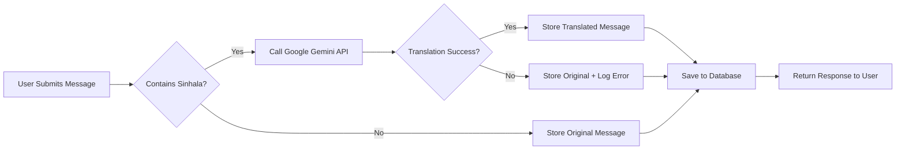
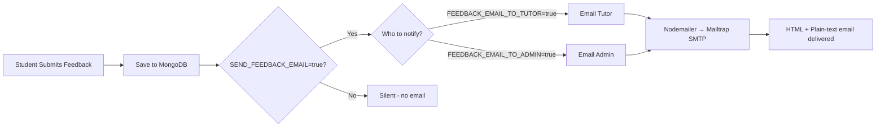

<div align="center">

# 🎓 Quality Education Backend

### A Web-Based Peer Learning and Tutoring Platform for School Students


</div>

---

## 📌 Overview

**Quality Education** is a web-based peer-learning and tutoring platform designed to connect school students with qualified tutors in an efficient and scalable manner.

The platform enables students to request academic help, **automatically translates Sinhala messages into English** using the **Google Gemini API**, and allows tutors to respond effectively.

This system promotes **accessible, structured, and collaborative digital education**.

---

## 🚀 Key Features

### 🔐 Authentication & Authorization
👨‍💻 Developed by **H A S Maduwantha** — Student ID: `IT23472020`
- ✅ **Role-based access control (RBAC)**
- ✅ Secure login & registration
- ✅ JWT-based authentication
- ✅ Three user roles:
  - 👨‍🎓 **Student (User)**
  - 👨‍🏫 **Tutor**
  - 🛡️ **Admin**

### 💬 Help Request Management (Full CRUD)
👨‍💻 Developed by **H A S Maduwantha** — Student ID: `IT23472020`
#### Students can:
- ✍️ Create help requests
- 👀 View submitted requests
- ✏️ Update messages (with translation support)
- 🗑️ Delete requests

#### Tutors & Admin can:
- 📋 View all help requests
- 💡 Respond to student queries

### 🌍 Sinhala to English Translation

- 🔍 **Detects Sinhala Unicode range** (0D80–0DFF)
- 🤖 **Automatically translates** to English using Google Gemini API
- 💾 Stores translated message in database
- ⚡ Avoids API call if message is already English (optimization)
- 🔄 **Translation on both create and update** operations

## 🏗️ System Architecture

```
┌─────────────────────────────────────────────────┐
│           Client (Student/Tutor/Admin)          │
└────────────────────┬────────────────────────────┘
                     │
                     ▼
┌─────────────────────────────────────────────────┐
│              Express.js API Layer               │
│  ┌───────────────────────────────────────────┐  │
│  │   Authentication & Authorization (JWT)    │  │
│  └───────────────────────────────────────────┘  │
│  ┌───────────────────────────────────────────┐  │
│  │   Controllers (Business Logic Layer)      │  │
│  └───────────────────────────────────────────┘  │
│  ┌───────────────────────────────────────────┐  │
│  │   Services (Translation, Validation)      │  │
│  └───────────────────┬───────────────────────┘  │
└────────────────────┬─┴──────────────────────────┘
                     │     │
        ┌────────────┘     └──────────────┐
        ▼                                  ▼
┌──────────────────┐            ┌──────────────────┐
│  MongoDB Atlas   │            │  Google Gemini   │
│   (Database)     │            │   API (AI/ML)    │
└──────────────────┘            └──────────────────┘
```

**Key Architecture Components:**
- 🎯 Role-Based Access Control (RBAC)
- 🔄 RESTful API architecture
- 🔌 Third-party API integration (Google Gemini)
- 📦 Modular controller-service structure
- 🔒 Secure environment variable configuration

---

## 🛠️ Tech Stack

### Backend Technologies
| Technology | Purpose |
|-----------|---------|
|  | Runtime Environment |
|  | Web Framework |
|  | NoSQL Database |
|  | Object Data Modeling |

### Authentication & Security
- 🔐 **JWT (JSON Web Tokens)**
- 🔒 **bcrypt.js** for password hashing
- 🛡️ **express-validator** for input validation
- 🍪 **cookie-parser** for secure cookie handling

### Third-Party Integration
- 🤖 **Google Gemini API** - Sinhala to English translation
- 📦 **Multer** - File upload handling
- ☁️ **Cloudinary** - Cloud storage for study material files (PDF, DOC, images)
- 📅 **Google Calendar API** - Automatic event creation for tutoring sessions
- 📧 **Nodemailer + Mailtrap (SMTP)** - Feedback notification emails to tutors and admins

---
## 🌍 Translation Workflow


```mermaid
graph LR
    A[User Submits Message] --> B{Contains Sinhala?}
    B -->|Yes| C[Call Google Gemini API]
    B -->|No| D[Store Original Message]
    C --> E{Translation Success?}
    E -->|Yes| F[Store Translated Message]
    E -->|No| G[Store Original + Log Error]
    F --> H[Save to Database]
    D --> H
    G --> H
    H --> I[Return Response to User]
```

**Translation Features:**
- 🔍 Automatically detects Sinhala characters (Unicode range: 0D80-0DFF)
- 🤖 Uses Google Gemini 2.5 Flash model for translation
- ⚡ 10-second timeout for translation requests
- 💾 Stores only the final (translated or original) message
- 🔄 Works on both create and update operations
- 📊 Returns `translationPerformed` flag in response

---

### Testing Flow
1. ✅ Register a student account
2. ✅ Register a tutor account
3. ✅ Login with student credentials
4. ✅ Create a help request (try Sinhala text)
5. ✅ View all messages
6. ✅ Update message (try Sinhala text)
7. ✅ Delete message
8. ✅ Login with tutor credentials
9. ✅ View all student requests


### 📚 Study Materials & Resources
👨‍💻 Developed by **ALAHAKOON PB** — Student ID: `IT23405240`

- 📤 **Upload study materials** — PDF, DOC, DOCX, PPT, PPTX, TXT, images (max 5 MB) via Cloudinary
- 📋 **View & search** — full-text keyword search across title, description, and tags
- 🔍 **Filter** by subject, grade, and status (active / archived / pending)
- 📄 **Pagination & sorting** — latest, oldest, by subject or title
- ✏️ **Update** — edit metadata or replace file (old Cloudinary file auto-deleted)
- 🗑️ **Delete** — removes from DB and Cloudinary storage atomically
- 👤 **My Uploads** — tutors can view only their own materials
- 📊 **Engagement metrics** — view count (auto), download counter, like/unlike toggle
- 🔒 **Role-based access** — only tutors/admins can upload, update, or delete
- 🛡️ **Security** — NoSQL injection protection, likedBy array hidden, Cloudinary rollback on failure

### 📅 Peer Learning & Tutoring Sessions
👨‍💻 Developed by **SERASINGHE CS** — Student ID: `IT23401976`

- 🎯 **Create & Manage Sessions** — Tutors can create, update, and delete tutoring sessions
- 📆 **Google Calendar Integration** — Automatic event creation when tutors create sessions
- 👥 **Join & Leave Sessions** — Students can enroll/unenroll in available sessions
- 🔢 **Capacity Management** — Automatic tracking of enrolled students vs. max capacity
- 🔍 **Advanced Filtering** — Filter by subject, grade, tutor, date, and availability
- 📋 **My Sessions** — View enrolled sessions and sessions created by tutor
- 🎓 **Tutor-specific Sessions** — Get all sessions by a particular tutor
- ⏰ **Schedule Management** — Date, time, and duration tracking for all sessions
- 🔒 **Role-based access** — Only tutors can create/modify sessions, students can join
- ✅ **Real-time availability** — Auto-calculate available spots and prevent overbooking

### ⭐ Feedback, Ratings & Progress Tracking
👨‍💻 Developed by **NIMADITH LMH** — Student ID: `IT23242272`

- ✍️ **Submit Tutor Feedback** — Students submit ratings (1–5 stars) and written feedback for tutors, optionally linked to a specific session
- 🔄 **Upsert Feedback** — One feedback per student+tutor+session enforced via a unique compound index; re-submitting updates the existing record
- ⭐ **View Tutor Ratings** — Anyone can query aggregated rating stats: average score, total count, and a full 1★–5★ breakdown (MongoDB aggregation pipeline)
- 📋 **View Feedback Details** — Tutors/admins see the full message list; students can view all feedback they have personally submitted
- 🗑️ **Delete Feedback** — Students delete their own feedback; admins can delete any entry
- 📊 **Track Student Progress** — Tutors/admins create and update student progress records with topic, completion percentage (0–100%), and freeform notes
- 👤 **Role-Based Progress Access** — Students view only their own progress; tutors see only their assigned students; admins have full unrestricted access
- 📧 **SMTP Email Notifications** — Automatic HTML + plain-text email sent to the tutor and/or admin upon every feedback submission via Nodemailer + Mailtrap (SMTP)
- 🔒 **Role-based access control** — Only students can submit feedback; only tutors/admins can update student progress

---


## 📂 Project Structure

```
AF_Backend/
├── 📁 Config/
│   └── db.js                    # Database configuration
├── 📁 Controllers/
│   ├── authController.js              # Authentication logic
│   ├── messageContoller.js            # Message CRUD + Translation
│   ├── studyMaterialController.js     # Study Materials CRUD & metrics  [IT23405240]
│   ├── tutoringSessionController.js   # Tutoring Sessions CRUD           [IT23401976]
│   ├── tutorController.js             # Tutor management
│   ├── feedbackController.js          # Feedback & Ratings CRUD         [IT23242272]
│   ├── progressController.js          # Student Progress Tracking       [IT23242272]
│   ├── feedbackEmailController.js     # Feedback email notification     [IT23242272]
│   └── ...
├── 📁 Middleware/
│   ├── authMiddleware.js              # JWT verification & RBAC
│   ├── errorHandler.js                # Global error handling
│   ├── uploadMiddleware.js            # Multer + Cloudinary upload      [IT23405240]
│   ├── studyMaterialValidation.js     # Study material input validators [IT23405240]
│   ├── tutoringSessionValidator.js    # Session input validation        [IT23401976]
│   └── ValidatorMiddleware.js         # Auth input validation
├── 📁 models/
│   ├── UserModel.js                   # User/Tutor schema
│   ├── MessageModel.js                # Message schema
│   ├── StudyMaterialModel.js          # Study material schema            [IT23405240]
│   ├── TutoringSessionModel.js        # Tutoring session schema          [IT23401976]
│   ├── FeedbackModel.js               # Feedback & Ratings schema        [IT23242272]
│   ├── ProgressModel.js               # Student Progress schema          [IT23242272]
│   └── ...
├── 📁 Routes/
│   ├── authRouter.js                  # Authentication routes
│   ├── materialRouter.js              # Study material routes            [IT23405240]
│   ├── messageRouter.js               # Message routes
│   ├── tutoringSessionRouter.js       # Tutoring session routes          [IT23401976]
│   ├── tutorRouter.js                 # Tutor routes
│   ├── googleCalenderRouter.js        # Google Calendar integration      [IT23401976]
│   ├── feedbackRouter.js              # Feedback & Ratings routes        [IT23242272]
│   ├── progressRouter.js              # Student Progress routes          [IT23242272]
│   ├── feedbackEmailRoutes.js         # Feedback email notify route      [IT23242272]
│   └── index.js                       # Route aggregator
├── 📁 services/
│   ├── messageService.js              # Translation service
│   ├── studyMaterialService.js        # Study material business logic    [IT23405240]
│   ├── tutoringSessionService.js      # Tutoring session logic           [IT23401976]
│   ├── googleCalendarService.js       # Google Calendar integration      [IT23401976]
│   ├── feedbackMailService.js         # Feedback SMTP email service      [IT23242272]
│   └── ...
├── 📁 utils/
│   ├── generateToken.js               # JWT generation
│   ├── responseHandler.js             # Standardised API responses       [IT23405240]
│   ├── validationUtils.js             # ObjectId validation helper       [IT23405240]
│   ├── tutoringSessionUtils.js        # Session utilities                [IT23401976]
│   ├── googleCalender.js              # Google Calendar helper           [IT23401976]
│   └── passwordUtils.js               # Password hashing
├── 📁 postman/
│   └── StudyMaterials_Complete.postman_collection.json  # 30 API tests [IT23405240]
├── 📁 uploads/                     # Local file uploads (messages)
├── .env                            # Environment variables
├── server.js                       # Application entry point
└── package.json                    # Dependencies
```

---

## 🚦 Getting Started

### Prerequisites

- Node.js (v22.14.0 or higher)
- MongoDB (Local or Atlas)
- Google Gemini API Key

### Installation

1. **Clone the repository**
   ```bash
   git clone <repository-url>
   cd AF_Backend
   ```

2. **Install dependencies**
   ```bash
   npm install
   ```

3. **Configure environment variables**
   
   Create a `.env` file in the root directory:
   ```env
   PORT=5000
   MONGO_URI=your_mongodb_connection_string
   JWT_SECRET=your_jwt_secret_key
   JWT_EXPIRES_IN=1d
   GEMINI_API_KEY=your_google_gemini_api_key
   NODE_ENV=development

   # Study Materials – Cloudinary (IT23405240)
   CLOUDINARY_CLOUD_NAME=your_cloudinary_cloud_name
   CLOUDINARY_API_KEY=your_cloudinary_api_key
   CLOUDINARY_API_SECRET=your_cloudinary_api_secret

   # Feedback & Progress – SMTP Email (IT23242272)
   SEND_FEEDBACK_EMAIL=true
   FEEDBACK_EMAIL_TO_TUTOR=true
   FEEDBACK_EMAIL_TO_ADMIN=true
   ADMIN_NOTIFY_EMAIL=admin@qualityapp.com
   MAIL_HOST=smtp.mailtrap.io
   MAIL_PORT=2525
   MAIL_USER=your_mailtrap_username
   MAIL_PASS=your_mailtrap_password
   MAIL_FROM_NAME=Quality Education
   MAIL_FROM_EMAIL=no-reply@qualityedu.com
   ```

4. **Run the application**
   ```bash
   # Development mode with hot reload
   npm run dev

   # Production mode
   npm start
   ```

5. **Server will be running at**
   ```
   http://localhost:5000
   ```

---

## � Quick Start Testing (Beginner-Friendly)

### For Developers: First Time Running Tests?

**Time to Complete: ~10 minutes**

#### Step 1: Install Dev Dependencies ✅

```bash
# Skip this if already installed
npm install
```

#### Step 2: Run Unit Tests (Fastest - ~2 minutes)

```bash
# Test all components
npm run test:unit

# Or test specific component
npm run test:unit:sessions
```

**What you'll see:**
- ✅ Green checkmarks = tests passed
- ❌ Red X = test failed (check console for error details)

---

#### Step 3: Run Integration Tests (Medium - ~5 minutes)

```bash
# Test API endpoints
npm run test:integration

# Or test specific endpoints
npm run test:integration:sessions
```

**What's being tested:**
- API endpoint responses (200, 400, 403, 404)
- Database operations
- Authentication and authorization
- Error handling

---

#### Step 4: Run Performance Tests (Optional - ~5 minutes)

```bash
# Terminal 1: Start backend
npm run dev

# Terminal 2: Generate token and run performance test
npm run test:perf:helprequest:token
# Copy token from output into tests/performance/help-request-load-test.yml

npm run test:perf:helprequest

# Open generated report
tests/performance/helprequest-report.html
```

---

### 📊 All Testing Commands at a Glance

```bash
# Unit Tests
npm run test:unit                          # All unit tests
npm run test:unit:sessions                 # Tutoring sessions only

# Integration Tests  
npm run test:integration                   # All integration tests
npm run test:integration:sessions          # Tutoring sessions only

# Code Coverage
npm run test:coverage                      # Generate coverage report

# Performance Tests
npm run test:perf:token                    # Study materials tokens
npm run test:perf                          # Study materials load test
npm run test:perf:run                      # With JSON output
npm run test:perf:report                   # Generate HTML report

npm run test:perf:sessions:token           # Tutoring sessions tokens
npm run test:perf:sessions                 # Load test
npm run test:perf:sessions:run             # With JSON output
npm run test:perf:sessions:report          # Generate HTML report

npm run test:perf:helprequest:token        # Help request tokens
npm run test:perf:helprequest              # Load test
npm run test:perf:helprequest:run          # With JSON output
npm run test:perf:helprequest:report       # Generate HTML report
```

---

## 🏗️ Component Testing Strategy

This table shows which testing layers cover each component:

| Component | Developer | Unit Tests | Integration Tests | Performance Tests |
|-----------|-----------|:----------:|:----------------:|:----------------:|
| **Authentication** | IT23472020 | ✅ | ✅ | ✅ |
| **Help Requests (Messages)** | IT23472020 | ✅ | ✅ | ✅ Artillery |
| **Study Materials** | IT23405240 | ✅ | ✅ | ✅ Artillery |
| **Tutoring Sessions** | IT23401976 | ✅ | ✅ | ✅ Artillery |
| **Google Calendar** | IT23401976 | ✅ | ✅ | ✅ (Mocked) |
| **Feedback & Ratings** | IT23242272 | ✅ | ✅ | ✅ (in integration) |
| **Student Progress** | IT23242272 | ✅ | ✅ | ✅ (in integration) |
| **Email Notifications** | IT23242272 | ✅ | ✅ | ✅ (Mocked) |

**Legend:**
- ✅ = Fully tested
- ✅ (Mocked) = External APIs are mocked to avoid real calls
- ✅ Artillery = Load tested with Artillery.io

---

## 📌 Test Coverage by Scenario

### Scenario 1: Student Creates & Updates Help Request

**Flow:**
1. Student registers
2. Student creates help request with Sinhala text
3. Message auto-translates to English (Google Gemini API called)
4. Student updates message with another Sinhala text
5. Student deletes message

**Tested in:**
- ✅ Unit: `messageService.test.js` (translation logic)
- ✅ Integration: Manual workflow + automated tests
- ✅ Performance: Artillery with 80+ concurrent users

---

### Scenario 2: Tutor Creates Session & Manages Students

**Flow:**
1. Tutor creates tutoring session
2. Google Calendar event auto-created
3. Multiple students join session
4. Students leave session
5. Tutor updates session details
6. Tutor records student progress
7. Student views their progress

**Tested in:**
- ✅ Unit: `tutoringSessionService.test.js`, `tutoringSessionController.test.js`
- ✅ Integration: `tutoringSession.test.js` (43 test cases)
- ✅ Performance: `tutoring-session-load-test.yml`

---

### Scenario 3: Tutor Uploads Study Materials

**Flow:**
1. Tutor uploads PDF file
2. File stored in Cloudinary
3. Student searches materials by subject
4. Student downloads material (counter increments)
5. Student likes material (toggles)
6. Tutor updates material metadata
7. Admin deletes material

**Tested in:**
- ✅ Unit: `studyMaterialService.test.js`
- ✅ Integration: `studyMaterial.test.js` (30+ API tests)
- ✅ Performance: `study-material-load-test.yml`
- 📋 Postman: `StudyMaterials_Complete.postman_collection.json` (30 API tests)

---

### Scenario 4: Student Provides Feedback to Tutor

**Flow:**
1. Student submits rating (1-5 stars) for tutor
2. Email notification sent to tutor and admin
3. Tutor views all feedback received
4. Student views feedback they submitted
5. Admin can delete any feedback
6. Rating aggregation updated (avg, breakdown by stars)

**Tested in:**
- ✅ Unit: `feedbackController.test.js`
- ✅ Integration: Feedback endpoints in `tutoringSession.test.js`
- ✅ Email: Mocked Nodemailer in tests

---

## 📡 API Endpoints

### 🔐 Authentication Routes

#### 1️⃣ User Registration

**Endpoint:** `POST /api/auth/register`

**Request Body:**
```json
{
  "fullName": "Shani Navodya",
  "email": "shaninavodya@2001gmail.com",
  "password": "shaninavodya@2001",
  "phoneNumber": "0771234568",
  "location": "Weligama"
}
```

**Response:**
```json
{
  "msg": "User Created Successfully"
}
```

**Validation Rules:**
- `fullName`: 3-50 characters
- `email`: Valid email format (unique)
- `password`: Minimum 6 characters
- `phoneNumber`: 10 digits
- `location`: Required

---

#### 2️⃣ Tutor Registration

**Endpoint:** `POST /api/auth/register`

**Request Body:**
```json
{
  "fullName": "Shani",
  "email": "shaninavodya@2002gmail.com",
  "password": "shaninavodya@2002",
  "phoneNumber": "0771234512",
  "location": "Weligama",
  "role": "tutor",
  "subjects": ["Science", "Mathematics", "Physics"]
}
```

**Response:**
```json
{
  "msg": "Tutor registered successfully"
}
```

**Additional Fields (Optional):**
```json
{
  "tutorProfile": {
    "bio": "Experienced tutor with 5 years of teaching",
    "experience": 5,
    "hourlyRate": 2000,
    "languages": ["English", "Sinhala", "Tamil"],
    "qualifications": [
      {
        "degree": "BSc in Mathematics",
        "institution": "University of Colombo",
        "year": 2018
      }
    ]
  }
}
```

---

#### 3️⃣ Admin Registration

**Endpoint:** `POST /api/auth/register`

**Request Body:**
```json
{
  "fullName": "John Doe",
  "email": "john.doe@example.com",
  "password": "password123",
  "phoneNumber": "0771234512",
  "location": "Weligama",
  "role": "admin"
}
```

**Response:**
```json
{
  "msg": "Admin registered successfully"
}
```

---

#### 4️⃣ Login

**Endpoint:** `POST /api/auth/login`

**Request Body:**
```json
{
  "email": "shaninavodya@2001gmail.com",
  "password": "shaninavodya@2001"
}
```

**Response:**
```json
{
  "msg": "User logged in",
  "token": "eyJhbGciOiJIUzI1NiIsInR5cCI6IkpXVCJ9...",
  "user": {
    "role": "user",
    "name": "Shani Navodya",
    "email": "shaninavodya@2001gmail.com"
  }
}
```

---

#### 5️⃣ Logout

**Endpoint:** `POST /api/auth/logout`

**Response:**
```json
{
  "msg": "User logged out"
}
```

---

### 💬 Message Routes (Help Requests)

#### 1️⃣ Create Message (with Translation)

**Endpoint:** `POST /api/messages`

**Headers:**
```json
{
  "Authorization": "Bearer <token>",
  "Content-Type": "application/json"
}
```

**Request Body:**
```json
{
  "message": "මට ගණිතයේ උදව්වක් අවශ්‍යයි"
}
```

**Response:**
```json
{
  "success": true,
  "msg": "Message created successfully",
  "message": {
    "_id": "507f1f77bcf86cd799439011",
    "message": "I need help with mathematics",
    "requiresTranslation": true,
    "createdBy": {
      "_id": "507f1f77bcf86cd799439012",
      "fullName": "Shani Navodya",
      "email": "shaninavodya@2001gmail.com",
      "role": "user"
    },
    "createdAt": "2026-02-27T10:30:00.000Z"
  },
  "translationPerformed": true
}
```

---

#### 2️⃣ Get All Messages

**Endpoint:** `GET /api/messages`

**Headers:**
```json
{
  "Authorization": "Bearer <token>"
}
```

**Response:**
```json
{
  "messages": [
    {
      "_id": "507f1f77bcf86cd799439011",
      "message": "I need help with mathematics",
      "requiresTranslation": true,
      "createdBy": {
        "fullName": "Shani Navodya",
        "email": "shaninavodya@2001gmail.com",
        "role": "user"
      },
      "createdAt": "2026-02-27T10:30:00.000Z"
    }
  ]
}
```

**Access Control:**
- **Students**: See only their own messages
- **Tutors/Admins**: See all messages

---

#### 3️⃣ Update Message (with Translation)

**Endpoint:** `PUT /api/messages/:id`

**Headers:**
```json
{
  "Authorization": "Bearer <token>",
  "Content-Type": "application/json"
}
```

**Request Body:**
```json
{
  "message": "භෞතික විද්‍යාව සඳහා උදව්වක් අවශ්‍යයි"
}
```

**Response:**
```json
{
  "success": true,
  "msg": "Message updated successfully",
  "message": {
    "_id": "507f1f77bcf86cd799439011",
    "message": "I need help with physics",
    "requiresTranslation": true,
    "createdBy": {
      "_id": "507f1f77bcf86cd799439012",
      "fullName": "Shani Navodya",
      "email": "shaninavodya@2001gmail.com",
      "role": "user"
    },
    "updatedAt": "2026-02-27T11:00:00.000Z"
  },
  "translationPerformed": true
}
```

---

#### 4️⃣ Delete Message

**Endpoint:** `DELETE /api/messages/:id`

**Headers:**
```json
{
  "Authorization": "Bearer <token>"
}
```

**Response:**
```json
{
  "msg": "Message deleted successfully"
}
```

---

## 📚 Study Materials & Resources API
👨‍💻 Developed by **ALAHAKOON PB** — Student ID: `IT23405240`

> Base URL: `/api/materials` | Auth: `Bearer <token>` required on all routes

### 1️⃣ Upload Study Material

**Endpoint:** `POST /api/materials`  
**Access:** Tutor / Admin only  
**Content-Type:** `multipart/form-data`

| Field | Type | Required | Description |
|---|---|---|---|
| `title` | string | ✅ | 3–150 characters |
| `description` | string | ✅ | 10–2000 characters |
| `subject` | string | ✅ | e.g. `mathematics` |
| `grade` | string | ✅ | e.g. `Grade 9` |
| `file` | file | ✅ | PDF, DOC, DOCX, PPT, PPTX, TXT, image (max 5 MB) |
| `tags` | string | ❌ | JSON array string e.g. `["algebra","equations"]` (max 10) |

**Response:**
```json
{
  "success": true,
  "message": "Study material uploaded successfully",
  "data": {
    "_id": "64f1a2b3c4d5e6f7a8b9c0d1",
    "title": "Introduction to Algebra",
    "subject": "mathematics",
    "grade": "Grade 9",
    "fileUrl": "https://res.cloudinary.com/...",
    "metrics": { "views": 0, "downloads": 0, "likes": 0 },
    "status": "active"
  }
}
```

---

### 2️⃣ Get All Materials (with Filters & Pagination)

**Endpoint:** `GET /api/materials`  
**Access:** All authenticated users

**Query Parameters:**
| Param | Example | Description |
|---|---|---|
| `subject` | `mathematics` | Filter by subject |
| `grade` | `Grade 9` | Filter by grade |
| `status` | `active` | `active` \| `archived` \| `pending` |
| `keyword` | `algebra` | Full-text search (title, description, tags) |
| `sort` | `latest` | `latest` \| `oldest` \| `subject` \| `title` |
| `page` | `1` | Page number (default: 1) |
| `limit` | `10` | Results per page (default: 10, max: 100) |

**Response:**
```json
{
  "success": true,
  "data": [ /* array of materials */ ],
  "pagination": {
    "total": 25,
    "pages": 3,
    "currentPage": 1,
    "limit": 10,
    "hasMore": true
  }
}
```

---

### 3️⃣ Get My Uploads

**Endpoint:** `GET /api/materials/my`  
**Access:** Tutor / Admin only  
Supports same query parameters as Get All.

---

### 4️⃣ Get Single Material

**Endpoint:** `GET /api/materials/:id`  
**Access:** All authenticated users  
⚡ Automatically increments `metrics.views` on every call.

---

### 5️⃣ Update Material

**Endpoint:** `PATCH /api/materials/:id`  
**Access:** Uploader or Admin only  
**Content-Type:** `multipart/form-data`  
All fields optional. Attach a new `file` to replace the existing one (old file auto-deleted from Cloudinary).

---

### 6️⃣ Delete Material

**Endpoint:** `DELETE /api/materials/:id`  
**Access:** Uploader or Admin only  
Deletes from MongoDB **and** removes the file from Cloudinary.

---

### 7️⃣ Record Download

**Endpoint:** `POST /api/materials/:id/download`  
**Access:** All authenticated users  
Increments `metrics.downloads` by 1.

```json
{ "success": true, "message": "Download recorded", "data": { "downloads": 5 } }
```

---

### 8️⃣ Like / Unlike Material

**Endpoint:** `POST /api/materials/:id/like`  
**Access:** All authenticated users  
Toggle — same endpoint likes on 1st call, unlikes on 2nd call. Prevents duplicate likes per user.

```json
{ "success": true, "message": "Material liked", "data": { "likes": 12 } }
```

---

## 📅 Peer Learning & Tutoring Sessions API
👨‍💻 Developed by **SERASINGHE CS** — Student ID: `IT23401976`

> Base URL: `/api/tutoring-sessions` | Auth: `Bearer <token>` required on all routes

### 1️⃣ Create Tutoring Session

**Endpoint:** `POST /api/tutoring-sessions`  
**Access:** Tutor / Admin only  
**Content-Type:** `application/json`

**Request Body:**
```json
{
  "title": "Advanced Mathematics - Calculus",
  "description": "Comprehensive calculus session covering derivatives and integrals",
  "subject": "Mathematics",
  "grade": "Grade 12",
  "date": "2026-03-15",
  "startTime": "14:00",
  "endTime": "16:00",
  "maxCapacity": 25,
  "meetingLink": "https://zoom.us/j/123456789",
  "isOnline": true
}
```

**Response:**
```json
{
  "success": true,
  "message": "Tutoring session created successfully",
  "data": {
    "_id": "64f1a2b3c4d5e6f7a8b9c0d1",
    "title": "Advanced Mathematics - Calculus",
    "subject": "Mathematics",
    "grade": "Grade 12",
    "tutor": {
      "_id": "64f1a2b3c4d5e6f7a8b9c0d2",
      "fullName": "John Doe",
      "email": "john@example.com"
    },
    "date": "2026-03-15T00:00:00.000Z",
    "startTime": "14:00",
    "endTime": "16:00",
    "maxCapacity": 25,
    "enrolledStudents": [],
    "availableSpots": 25,
    "status": "scheduled",
    "isOnline": true,
    "meetingLink": "https://zoom.us/j/123456789",
    "googleCalendarEventId": "abc123xyz",
    "createdAt": "2026-02-27T10:00:00.000Z"
  },
  "googleCalendarEvent": "Event created successfully"
}
```

---

### 2️⃣ Get All Tutoring Sessions (with Filters)

**Endpoint:** `GET /api/tutoring-sessions`  
**Access:** All authenticated users

**Query Parameters:**
| Param | Example | Description |
|---|---|---|
| `subject` | `Mathematics` | Filter by subject |
| `grade` | `Grade 12` | Filter by grade |
| `tutor` | `64f1a2b3...` | Filter by tutor ID |
| `status` | `scheduled` | `scheduled` \| `ongoing` \| `completed` \| `cancelled` |
| `date` | `2026-03-15` | Filter by specific date |
| `isOnline` | `true` | Filter online/offline sessions |
| `available` | `true` | Show only sessions with available spots |
| `page` | `1` | Page number (default: 1) |
| `limit` | `10` | Results per page (default: 10, max: 50) |

**Response:**
```json
{
  "success": true,
  "data": [
    {
      "_id": "64f1a2b3c4d5e6f7a8b9c0d1",
      "title": "Advanced Mathematics - Calculus",
      "subject": "Mathematics",
      "grade": "Grade 12",
      "tutor": {
        "_id": "64f1a2b3c4d5e6f7a8b9c0d2",
        "fullName": "John Doe",
        "email": "john@example.com"
      },
      "date": "2026-03-15T00:00:00.000Z",
      "startTime": "14:00",
      "endTime": "16:00",
      "maxCapacity": 25,
      "enrolledStudents": 5,
      "availableSpots": 20,
      "status": "scheduled",
      "isOnline": true
    }
  ],
  "pagination": {
    "total": 15,
    "pages": 2,
    "currentPage": 1,
    "limit": 10
  }
}
```

---

### 3️⃣ Get Single Tutoring Session

**Endpoint:** `GET /api/tutoring-sessions/:id`  
**Access:** All authenticated users

**Response:**
```json
{
  "success": true,
  "data": {
    "_id": "64f1a2b3c4d5e6f7a8b9c0d1",
    "title": "Advanced Mathematics - Calculus",
    "description": "Comprehensive calculus session covering derivatives and integrals",
    "subject": "Mathematics",
    "grade": "Grade 12",
    "tutor": {
      "_id": "64f1a2b3c4d5e6f7a8b9c0d2",
      "fullName": "John Doe",
      "email": "john@example.com",
      "subjects": ["Mathematics", "Physics"]
    },
    "date": "2026-03-15T00:00:00.000Z",
    "startTime": "14:00",
    "endTime": "16:00",
    "maxCapacity": 25,
    "enrolledStudents": [
      {
        "_id": "64f1a2b3c4d5e6f7a8b9c0d3",
        "fullName": "Jane Smith",
        "email": "jane@example.com"
      }
    ],
    "availableSpots": 24,
    "status": "scheduled",
    "isOnline": true,
    "meetingLink": "https://zoom.us/j/123456789",
    "googleCalendarEventId": "abc123xyz",
    "createdAt": "2026-02-27T10:00:00.000Z",
    "updatedAt": "2026-02-27T10:00:00.000Z"
  }
}
```

---

### 4️⃣ Get My Enrolled Sessions

**Endpoint:** `GET /api/tutoring-sessions/my-enrolled`  
**Access:** Student / Tutor / Admin

**Response:**
```json
{
  "success": true,
  "count": 3,
  "data": [
    {
      "_id": "64f1a2b3c4d5e6f7a8b9c0d1",
      "title": "Advanced Mathematics - Calculus",
      "subject": "Mathematics",
      "tutor": {
        "fullName": "John Doe",
        "email": "john@example.com"
      },
      "date": "2026-03-15T00:00:00.000Z",
      "startTime": "14:00",
      "endTime": "16:00",
      "status": "scheduled",
      "isOnline": true,
      "meetingLink": "https://zoom.us/j/123456789"
    }
  ]
}
```

---

### 5️⃣ Get Sessions by Tutor

**Endpoint:** `GET /api/tutoring-sessions/tutor/:tutorId`  
**Access:** All authenticated users

**Response:**
```json
{
  "success": true,
  "tutor": {
    "_id": "64f1a2b3c4d5e6f7a8b9c0d2",
    "fullName": "John Doe",
    "email": "john@example.com",
    "subjects": ["Mathematics", "Physics"]
  },
  "count": 8,
  "data": [
    {
      "_id": "64f1a2b3c4d5e6f7a8b9c0d1",
      "title": "Advanced Mathematics - Calculus",
      "subject": "Mathematics",
      "grade": "Grade 12",
      "date": "2026-03-15T00:00:00.000Z",
      "startTime": "14:00",
      "endTime": "16:00",
      "enrolledStudents": 15,
      "availableSpots": 10,
      "status": "scheduled"
    }
  ]
}
```

---

### 6️⃣ Update Tutoring Session

**Endpoint:** `PATCH /api/tutoring-sessions/:id`  
**Access:** Session creator (Tutor) or Admin only  
**Content-Type:** `application/json`

**Request Body:** (All fields optional)
```json
{
  "title": "Advanced Mathematics - Calculus & Limits",
  "description": "Updated description with additional topics",
  "maxCapacity": 30,
  "meetingLink": "https://zoom.us/j/987654321",
  "status": "scheduled"
}
```

**Response:**
```json
{
  "success": true,
  "message": "Tutoring session updated successfully",
  "data": {
    "_id": "64f1a2b3c4d5e6f7a8b9c0d1",
    "title": "Advanced Mathematics - Calculus & Limits",
    "maxCapacity": 30,
    "availableSpots": 29,
    "updatedAt": "2026-02-27T11:00:00.000Z"
  }
}
```

---

### 7️⃣ Delete Tutoring Session

**Endpoint:** `DELETE /api/tutoring-sessions/:id`  
**Access:** Session creator (Tutor) or Admin only

**Response:**
```json
{
  "success": true,
  "message": "Tutoring session deleted successfully"
}
```

---

### 8️⃣ Join Tutoring Session

**Endpoint:** `POST /api/tutoring-sessions/:id/join`  
**Access:** All authenticated users (typically students)

**Response:**
```json
{
  "success": true,
  "message": "Successfully joined the tutoring session",
  "data": {
    "_id": "64f1a2b3c4d5e6f7a8b9c0d1",
    "title": "Advanced Mathematics - Calculus",
    "enrolledStudents": 6,
    "availableSpots": 19
  }
}
```

**Error Cases:**
```json
{
  "success": false,
  "message": "Session is already full",
  "error": "No available spots"
}
```

```json
{
  "success": false,
  "message": "Already enrolled in this session"
}
```

---

### 9️⃣ Leave Tutoring Session

**Endpoint:** `POST /api/tutoring-sessions/:id/leave`  
**Access:** Enrolled student

**Response:**
```json
{
  "success": true,
  "message": "Successfully left the tutoring session",
  "data": {
    "_id": "64f1a2b3c4d5e6f7a8b9c0d1",
    "title": "Advanced Mathematics - Calculus",
    "enrolledStudents": 5,
    "availableSpots": 20
  }
}
```

**Error Case:**
```json
{
  "success": false,
  "message": "You are not enrolled in this session"
}
```

---

### 🔟 Google Calendar Integration

When a tutor creates a tutoring session, the system automatically:
- ✅ Creates a Google Calendar event
- 📧 Sends invitations to the tutor
- 🔗 Returns a Google Calendar event ID
- 📅 Syncs session details (title, date, time, description)
- 🔄 Updates the event when session details change

**Environment Variables Required:**
```env
GOOGLE_CLIENT_ID=your_google_client_id
GOOGLE_CLIENT_SECRET=your_google_client_secret
GOOGLE_REDIRECT_URI=your_redirect_uri
```

---

## ⭐ Feedback, Ratings & Progress API
👨‍💻 Developed by **NIMADITH LMH** — Student ID: `IT23242272`

> Base URL: `/api/feedbacks` & `/api/progress` | Auth: `Bearer <token>` required on all routes

---

### 1️⃣ Submit / Update Feedback

**Endpoint:** `POST /api/feedbacks`
**Access:** Student only

**Request Body:**
```json
{
  "tutorId": "64f1a2b3c4d5e6f7a8b9c0d2",
  "rating": 5,
  "message": "Excellent session, very clear explanations!",
  "sessionId": "64f1a2b3c4d5e6f7a8b9c0d1"
}
```

**Response:**
```json
{
  "message": "Feedback saved",
  "feedback": {
    "_id": "64f1a2b3c4d5e6f7a8b9c0f9",
    "student": "64f1a2b3c4d5e6f7a8b9c0d3",
    "tutor": "64f1a2b3c4d5e6f7a8b9c0d2",
    "session": "64f1a2b3c4d5e6f7a8b9c0d1",
    "rating": 5,
    "message": "Excellent session, very clear explanations!",
    "createdAt": "2026-02-27T10:30:00.000Z"
  }
}
```

> ✅ Automatically sends an HTML notification email to the tutor and/or admin via SMTP (Mailtrap).

---

### 2️⃣ Get My Submitted Feedbacks

**Endpoint:** `GET /api/feedbacks/me`
**Access:** Authenticated student

**Response:**
```json
{
  "count": 2,
  "feedbacks": [
    {
      "_id": "64f1a2b3c4d5e6f7a8b9c0f9",
      "tutor": { "fullName": "John Doe", "email": "john@example.com", "role": "tutor" },
      "rating": 5,
      "message": "Excellent session!",
      "createdAt": "2026-02-27T10:30:00.000Z"
    }
  ]
}
```

---

### 3️⃣ Get Tutor Rating Stats

**Endpoint:** `GET /api/feedbacks/tutor/:tutorId/ratings`
**Access:** Any authenticated user (students use this to evaluate tutors)

**Response:**
```json
{
  "tutorId": "64f1a2b3c4d5e6f7a8b9c0d2",
  "avgRating": 4.67,
  "totalRatings": 15,
  "breakdown": {
    "1": 0,
    "2": 1,
    "3": 1,
    "4": 4,
    "5": 9
  }
}
```

---

### 4️⃣ Get Tutor Feedback Messages

**Endpoint:** `GET /api/feedbacks/tutor/:tutorId`
**Access:** Tutor (self only) or Admin

**Response:**
```json
{
  "count": 3,
  "feedbacks": [
    {
      "_id": "64f1a2b3c4d5e6f7a8b9c0f9",
      "student": { "fullName": "Jane Smith", "email": "jane@example.com" },
      "rating": 5,
      "message": "Very helpful!",
      "createdAt": "2026-02-27T10:30:00.000Z"
    }
  ]
}
```

---

### 5️⃣ Delete Feedback

**Endpoint:** `DELETE /api/feedbacks/:id`
**Access:** Feedback owner (student) or Admin

**Response:**
```json
{ "message": "Feedback deleted" }
```

---

### 6️⃣ Create / Update Student Progress

**Endpoint:** `POST /api/progress`
**Access:** Tutor (own students), Student (self), Admin

**Request Body:**
```json
{
  "studentId": "64f1a2b3c4d5e6f7a8b9c0d3",
  "tutorId": "64f1a2b3c4d5e6f7a8b9c0d2",
  "sessionId": "64f1a2b3c4d5e6f7a8b9c0d1",
  "topic": "Quadratic Equations",
  "completionPercent": 75,
  "notes": "Student grasped factoring; needs more practice on the quadratic formula."
}
```

**Response:**
```json
{
  "message": "Progress saved",
  "progress": {
    "_id": "64f1a2b3c4d5e6f7a8b9c0e1",
    "student": "64f1a2b3c4d5e6f7a8b9c0d3",
    "tutor": "64f1a2b3c4d5e6f7a8b9c0d2",
    "session": "64f1a2b3c4d5e6f7a8b9c0d1",
    "topic": "Quadratic Equations",
    "completionPercent": 75,
    "notes": "Student grasped factoring; needs more practice on the quadratic formula.",
    "updatedAt": "2026-02-27T12:00:00.000Z"
  }
}
```

---

### 7️⃣ View My Progress (Student)

**Endpoint:** `GET /api/progress/me`
**Access:** Authenticated student

**Response:**
```json
{
  "count": 3,
  "progress": [
    {
      "_id": "64f1a2b3c4d5e6f7a8b9c0e1",
      "tutor": { "fullName": "John Doe", "email": "john@example.com" },
      "topic": "Quadratic Equations",
      "completionPercent": 75,
      "notes": "...",
      "updatedAt": "2026-02-27T12:00:00.000Z"
    }
  ]
}
```

---

### 8️⃣ View Progress by Student ID

**Endpoint:** `GET /api/progress/student/:studentId`
**Access:** The student (self), their tutor, or Admin

---

### 9️⃣ View Progress by Tutor

**Endpoint:** `GET /api/progress/tutor/:tutorId`
**Access:** Tutor (self) or Admin — returns all student progress records for that tutor

---

### 📧 SMTP Feedback Email Notification Workflow


```mermaid
graph LR
    A[Student Submits Feedback] --> B[Save to MongoDB]
    B --> C{SEND_FEEDBACK_EMAIL=true?}
    C -->|Yes| D{Who to notify?}
    C -->|No| E[Silent - no email]
    D -->|FEEDBACK_EMAIL_TO_TUTOR=true| F[Email Tutor]
    D -->|FEEDBACK_EMAIL_TO_ADMIN=true| G[Email Admin]
    F --> H[Nodemailer → Mailtrap SMTP]
    G --> H
    H --> I[HTML + Plain-text email delivered]
```

**Email contains:** Tutor name, Student name, Rating (★/5), Session ID, and the full feedback message.

---


## 🔐 Security Considerations

| Security Feature | Implementation |
|-----------------|----------------|
| 🔒 Password Security | bcrypt hashing with salt rounds |
| 🎫 Authentication | JWT tokens stored in HTTP-only cookies |
| 🛡️ Authorization | Role-based middleware protection |
| ✅ Input Validation | express-validator for all inputs |
| 🔑 API Keys | Secure environment variable storage |
| 🌐 CORS | Configured for production security |
| 📝 Error Handling | Custom error classes with safe messages |
| 🛡️ NoSQL Injection | escapeRegex on dynamic $regex queries (Study Materials) |
| 🙈 Data Privacy | likedBy array hidden from all API responses (Study Materials) |
| ☁️ Cloud Rollback | Cloudinary file deleted if DB save fails (Study Materials) |

---

## 🧪 Comprehensive Testing Guide

This project implements a **3-layer testing strategy** for quality assurance:

| Layer | Tool | Purpose | Scope |
|---|---|---|---|
| **Unit Tests** | Jest + `@jest/globals` | Test individual functions and services in isolation | No DB, no HTTP calls |
| **Integration Tests** | Jest + Supertest + MongoMemoryServer | Test API endpoints with real HTTP and in-memory DB | Full API flow testing |
| **Performance Tests** | Artillery.io | Load testing under 100 concurrent users | Response time & throughput analysis |

---

### 📋 Test Folder Structure

```
tests/
├── setup/                          # Shared testing utilities
│   ├── testApp.js                 # Express app for integration tests
│   ├── dbHandler.js               # MongoMemoryServer configuration
│   ├── testHelpers.js             # JWT & data factories
│   └── jest.setup.js              # Jest configuration
│
├── unit/                          # Unit tests (pure functions)
│   ├── validationUtils.test.js
│   ├── responseHandler.test.js
│   ├── tutoringSessionValidation.test.js
│   ├── tutoringSessionUtils.test.js
│   ├── tutoringSessionService.test.js
│   └── tutoringSessionController.test.js
│
├── integration/                   # Integration tests (API endpoints)
│   ├── studyMaterial.test.js      # All 8 Study Material endpoints
│   └── tutoringSession.test.js    # All 9 Tutoring Session endpoints
│
└── performance/                   # Performance & load tests
    ├── study-material-load-test.yml
    ├── tutoring-session-load-test.yml
    ├── help-request-load-test.yml
    ├── generate-perf-token.js
    ├── HELP_REQUEST_PERFORMANCE_TESTING.md
    └── ...
```

---

### 🔧 Installation & Setup

All test dependencies are pre-installed. To verify:

```bash
# Install test dependencies (if needed)
npm install --save-dev jest supertest mongodb-memory-server @jest/globals

# Install Artillery globally (for performance tests)
npm install -g artillery@latest
```

---

## ✅ Layer 1: Unit Tests

Unit tests validate **pure functions and service logic in isolation** without database or HTTP.

### What's Tested:

- ✅ **Validation Functions** — Input sanitization, ObjectId checks, email validation
- ✅ **Response Handlers** — Success/error/paginated response formatting
- ✅ **Service Methods** — Business logic (CRUD, filtering, calculations)
- ✅ **Controller Handlers** — HTTP status codes and response shapes
- ✅ **Middleware** — Authentication, authorization, input validation

### Run Unit Tests:

```bash
# All unit tests
npm run test:unit

# Tutoring sessions unit tests only
npm run test:unit:sessions

# Watch mode (auto-run on file changes)
npm run test:unit -- --watch

# With coverage report
npm run test:coverage
```

### Expected Output:

```
PASS  tests/unit/validationUtils.test.js
PASS  tests/unit/responseHandler.test.js
PASS  tests/unit/tutoringSessionValidation.test.js
PASS  tests/unit/tutoringSessionService.test.js
PASS  tests/unit/tutoringSessionController.test.js

Tests: 94 passed | Time: ~1.5s
Coverage: 85%+
```

---

## 🔗 Layer 2: Integration Tests

Integration tests verify **API endpoints with real HTTP requests** against an in-memory MongoDB.

### What's Tested:

| Component | Endpoint | Scenarios |
|-----------|----------|-----------|
| **Study Materials** | 8 endpoints | Upload, Get All, Filter, Search, Download, Like, Metrics |
| **Tutoring Sessions** | 9 endpoints | Create, Get All, Join, Leave, Calendar Sync |
| **Success Cases** | ✅ | Valid requests return 200/201/204 |
| **Error Cases** | ❌ | Invalid input returns 400, unauthorized returns 403, not found returns 404 |
| **Edge Cases** | 🔲 | Boundary values, empty results, duplicates |

### Run Integration Tests:

```bash
# All integration tests
npm run test:integration

# Tutoring sessions integration tests only
npm run test:integration:sessions

# Single test file
npm run test:integration -- studyMaterial.test.js

# Watch mode (auto-run on file changes)
npm run test:integration -- --watch
```

### Expected Output:

```
PASS  tests/integration/studyMaterial.test.js

  POST /api/materials — Upload Material
    ✓ ✅ SUCCESS — tutor uploads a file (201)
    ✓ ❌ ERROR — student role blocked (403)
    ✓ ❌ ERROR — missing file returns 400

  GET /api/materials — Get All Materials
    ✓ ✅ SUCCESS — returns paginated list (200)
    ✓ ✅ SUCCESS — filters by subject
    ✓ 🔲 EDGE — empty result returns []

Tests: 43 passed | Time: ~8s
```

---

## 🚀 Layer 3: Performance Tests (Artillery.io)

Performance tests simulate **realistic load** with 80+ concurrent users to validate response times and throughput.

### What's Tested:

✅ **Response Time**
- `p95` (95th percentile) < 1000ms
- `p99` (99th percentile) < 2000ms

✅ **Throughput**
- Requests per second under sustained load
- Error rate < 5%

✅ **Scalability**
- System behavior under peak load (80+ concurrent users)
- Graceful degradation

### Available Performance Tests:

#### 1️⃣ Study Materials Performance Test

**File:** `tests/performance/study-material-load-test.yml`

**Test Phases:**
- Warm-up: 5→15 users (20s)
- Sustained: 50 users (60s)
- Peak: 50→100 users (30s)

**Run Test:**
```bash
# Step 1: Generate JWT token
npm run test:perf:token

# Step 2: Update token in test file (when prompted)

# Step 3: Start backend server (in another terminal)
npm run dev

# Step 4: Run test and generate report
npm run test:perf:run
npm run test:perf:report

# Report generated at: tests/performance/report.html
```

---

#### 2️⃣ Tutoring Sessions Performance Test

**File:** `tests/performance/tutoring-session-load-test.yml`

**Test Phases:**
- Warm-up: 5→20 users (30s)
- Sustained: 60 users (60s)
- Peak: 60→100 users (30s)

**Run Test:**
```bash
# Step 1: Generate JWT token
npm run test:perf:sessions:token

# Step 2: Start backend server (in another terminal)
npm run dev

# Step 3: Run test and generate report
npm run test:perf:sessions:run
npm run test:perf:sessions:report

# Report generated at: tests/performance/sessions-report.html
```

---

#### 3️⃣ Help Request Performance Test

**File:** `tests/performance/help-request-load-test.yml`

**Test Scenarios:**
- Create help requests (30%)
- Retrieve all requests (35%)
- Tutor view all (10%)
- Admin view all (5%)
- Full lifecycle: Create→Update→Delete (15%)
- Stress test: Rapid creation (5%)

**Test Phases:**
- Warm-up: 5→15 users (20s)
- Sustained: 40 users (60s)
- Peak: 40→80 users (30s)
- Cool-down: 80→10 users (20s)

**Run Test:**
```bash
# Quick Start Guide for Help Request Testing

# Step 1: Generate performance testing tokens
npm run test:perf:helprequest:token

# Step 2: Update configuration file
# Copy tokens from output and paste into:
# tests/performance/help-request-load-test.yml
# Variables section: userToken, tutorToken, adminToken

# Step 3: Start backend server (in another terminal)
npm run dev

# Step 4: Run performance test (quick mode)
npm run test:perf:helprequest

# Step 5: Run with report generation (comprehensive)
npm run test:perf:helprequest:run
npm run test:perf:helprequest:report

# Report generated at: tests/performance/helprequest-report.html
```

---

### Performance Test Results Interpretation

After running a performance test, check the HTML report for:

```
✅ Response Time Percentiles:
   - p50: 320ms (median response time)
   - p95: 850ms (95% requests completed in this time)
   - p99: 1,200ms (99% requests completed in this time)

✅ Request Throughput:
   - Total requests: 2,500
   - Successful: 2,475 (99%)
   - Failed: 25 (1%)

✅ Error Rate:
   - 2xx (success): 99%
   - 4xx (client errors): 0.8%
   - 5xx (server errors): 0.2%
```

**Pass Criteria:**
- ✅ p95 < 1000ms
- ✅ p99 < 2000ms
- ✅ Success rate > 85%
- ✅ Error rate < 5%

---

## 📊 Test Coverage Report

Generate a coverage report to see which files are tested:

```bash
npm run test:coverage
```

Coverage report will be generated at: `tests/coverage/index.html`

**Coverage Targets:**
- Controllers: > 80%
- Services: > 85%
- Utilities: > 90%
- Middleware: > 75%

---

## 🧪 Testing with Postman

### Import Collection
1. Navigate to `postman/` folder
2. Import the workspace globals: `workspace.postman_globals.json`
3. Set the base URL: `http://localhost:5000`

---

### 📚 Study Materials Testing (IT23405240)

1. Import `postman/StudyMaterials_Complete.postman_collection.json` into Postman
2. Set Collection Variable `baseUrl` = `http://localhost:5000/api`
3. Run **Login** — token is auto-saved to `{{token}}`
4. Run **Upload Material** — material ID auto-saved to `{{materialId}}`
5. Test filters: `?subject=mathematics`, `?keyword=algebra`, `?grade=Grade 9`
6. Test metrics: Download counter, Like/Unlike toggle
7. Test error cases: no file, duplicate title, invalid ID, oversized file

---

### 📅 Tutoring Sessions Testing (IT23401976)

1. Import Postman collection or use manual requests
2. **Create Session** (as Tutor):
   ```bash
   POST /api/tutoring-sessions
   Authorization: Bearer <tutor-token>
   {
     "title": "Advanced Math",
     "subject": "Mathematics",
     "grade": "Grade 12",
     "date": "2026-03-15",
     "startTime": "14:00",
     "endTime": "16:00",
     "maxCapacity": 25
   }
   ```

3. **Join Session** (as Student):
   ```bash
   POST /api/tutoring-sessions/:sessionId/join
   Authorization: Bearer <student-token>
   ```

4. **Verify Google Calendar Event** — Check tutor's Google Calendar for auto-created event

---

### ⭐ Feedback, Ratings & Progress Testing (IT23242272)

1. Login as **student** — use token for feedback submission
2. **Submit Feedback:**
   ```bash
   POST /api/feedbacks
   Authorization: Bearer <student-token>
   {
     "tutorId": "64f1a2b3...",
     "rating": 5,
     "message": "Excellent teaching!"
   }
   ```

3. **Check Email Notification** — Verify in Mailtrap inbox (if configured)

4. **View Ratings:**
   ```bash
   GET /api/feedbacks/tutor/:tutorId/ratings
   Authorization: Bearer <token>
   ```

5. **Login as Tutor** — View feedback messages:
   ```bash
   GET /api/feedbacks/tutor/:tutorId
   Authorization: Bearer <tutor-token>
   ```

6. **Create Progress Record** (as Tutor):
   ```bash
   POST /api/progress
   Authorization: Bearer <tutor-token>
   {
     "studentId": "64f1a2b3...",
     "topic": "Quadratic Equations",
     "completionPercent": 75,
     "notes": "Good progress!"
   }
   ```

7. **View Progress** (as Student):
   ```bash
   GET /api/progress/me
   Authorization: Bearer <student-token>
   ```

---

### 💬 Help Request Testing (IT23472020)

1. **Create Help Request** (as Student):
   ```bash
   POST /api/messages
   Authorization: Bearer <student-token>
   {
     "message": "මට ගණිතයේ උදව්වක් අවශ්‍යයි"  # Sinhala text
   }
   ```
   ✅ Translation should be automatic (English: "I need help with mathematics")

2. **View Your Messages:**
   ```bash
   GET /api/messages
   Authorization: Bearer <student-token>
   ```
   ✅ Students see only their own messages

3. **View All Messages** (as Tutor/Admin):
   ```bash
   GET /api/messages
   Authorization: Bearer <tutor-token>
   ```
   ✅ Tutors/Admins see all messages

4. **Update Message** (as Student):
   ```bash
   PUT /api/messages/:messageId
   Authorization: Bearer <student-token>
   {
     "message": "අර්ජුනයි, අරුඹ/විද්‍යාව ගිණුම් සඳහා උදව්ව අවශ්‍යයි"
   }
   ```
   ✅ Translation should be automatic

5. **Delete Message** (as Student):
   ```bash
   DELETE /api/messages/:messageId
   Authorization: Bearer <student-token>
   ```

---

## 🛠️ Troubleshooting Common Test Issues

### Issue: Tests fail with "MongoDB connection error"
**Solution:** Ensure MongoMemoryServer is installed:
```bash
npm install --save-dev mongodb-memory-server
```

### Issue: Performance test shows "Cannot find token variable"
**Solution:** Generate token before running test:
```bash
npm run test:perf:token
# Copy the token and paste into the .yml file
```

### Issue: Artillery command not found
**Solution:** Install Artillery globally:
```bash
npm install -g artillery@latest
```

### Issue: Port 5000 already in use
**Solution:** Kill the process or use a different port:
```bash
# Kill process on port 5000 (Linux/Mac)
lsof -ti:5000 | xargs kill -9

# Kill process on port 5000 (Windows)
netstat -ano | findstr :5000
taskkill /PID <PID> /F
```

### Issue: JSON Web Token errors
**Solution:** Ensure token is valid and not expired:
```bash
# Generate a fresh token
npm run test:perf:token
# or 
npm run test:perf:sessions:token
# or 
npm run test:perf:helprequest:token
```

---

## 📚 Additional Testing Resources

- 📖 **Jest Documentation:** https://jestjs.io/
- 📖 **Supertest Documentation:** https://github.com/visionmedia/supertest
- 📖 **Artillery.io Documentation:** https://artillery.io/
- 📖 **MongoDB Memory Server:** https://github.com/nodkz/mongodb-memory-server
- 📄 **Full Testing Guide:** See `tests/TESTING_README.md`
- 📄 **Help Request Testing Guide:** See `tests/performance/HELP_REQUEST_PERFORMANCE_TESTING.md`

---

## 🤝 Contributing

Contributions are welcome! Please follow these steps:

1. Fork the repository
2. Create a feature branch (`git checkout -b feature/AmazingFeature`)
3. Commit your changes (`git commit -m 'Add some AmazingFeature'`)
4. Push to the branch (`git push origin feature/AmazingFeature`)
5. Open a Pull Request

---

## 👨‍💻 Contributors

| Name | Student ID | Component |
|---|---|---|
| H A S Maduwantha | IT23472020 | Authentication, Messages, Translation |
| **ALAHAKOON PB** | **IT23405240** | **Study Materials & Resources** |
| **SERASINGHE CS** | **IT23401976** | **Peer Learning & Tutoring Sessions** |
| **NIMADITH LMH** | **IT23242272** | **Feedback, Ratings & Progress Tracking** |

---

## 📄 License

This project is developed as part of an academic curriculum.

---

## 📞 Support

For support or queries, please contact:
- 📧 IT23472020@my.sliit.lk — H A S Maduwantha
- 📧 IT23405240@my.sliit.lk — ALAHAKOON PB
- 📧 IT23401976@my.sliit.lk — SERASINGHE CS
- 📧 IT23242272@my.sliit.lk — NIMADITH LMH
- 🎓 Institution: SLIIT

---

<div align="center">

### ⭐ If you find this project helpful, please give it a star!

Made by H A S Maduwantha, ALAHAKOON PB, SERASINGHE CS & NIMADITH LMH

</div>


